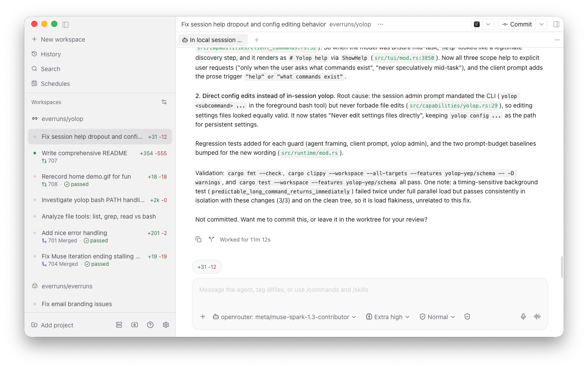

# yolop

[](https://github.com/everruns/yolop/releases)
[](https://github.com/everruns/yolop/actions/workflows/ci.yml)
[](LICENSE)
[](https://crates.io/crates/yolop)
[](AGENTS.md)

Yolop is a terminal coding agent that plans the fix, runs the commands, and shows every step. Point it at your repo, describe the outcome, watch it work.

```bash
yolop
# > add retry with backoff to the sync client, then run the tests for it
```


## Origin of the name

`yolop` comes from the Ukrainian `Йолоп`: a dummy, fool, or not-too-bright person. The name was meant to sound clever and funny in Ukrainian while also describing the agent's starting point: Yolop avoids per-tool approval pop-ups. Routine workspace work runs automatically; hard prompts are reserved for the configured shell boundary, with [soft approval](#trust-and-guardrails) for critical moments that need spoken consent and an audit trail.

## Contents

- [Origin of the name](#origin-of-the-name)
- [Why yolop](#why-yolop)
- [Install](#install)
- [Quickstart](#quickstart)
- [How you work with it](#how-you-work-with-it)
- [Trust and guardrails](#trust-and-guardrails)
- [Providers and models](#providers-and-models)
- [Context superpowers](#context-superpowers)
- [MCP servers](#mcp-servers)
- [Extensions](#extensions)
- [Skills, memory, and hooks](#skills-memory-and-hooks)
- [Reference](#reference)
- [Contributing, evals, releases, license](#contributing-evals-releases-license)

## Why yolop

- **Friday afternoon tasks, done.** Point it at the flaky test, the dependency bump, the "add JSON output" issue. Come back to a green suite and a diff you can actually read.
- **It already knows the repo.** Structural map, symbol search, workspace-wide renames. "Move auth refresh into its own module" just happens, references included.
- **Talk it into shape.** Providers, MCP servers, editor wiring, how careful to be. Ask in plain words or run one guided command; config files only when you want them.
- **It works where you work.** Full screen TUI when you want the show, `yolop -p` for pipes and CI, Paseo or Zed over ACP when you live in the editor.
- **It keeps its place.** Every run is a resumable session with checkpoints. Rewind the bad idea, redo the good one, pick the goal back up Monday.

## Install

Prerequisites: a Rust toolchain for source builds, `git`, and optionally the `gh` CLI for GitHub workflows.

```bash
# macOS
brew install everruns/tap/yolop

# Any platform with Cargo
cargo install yolop

# From source
git clone https://github.com/everruns/yolop.git
cd yolop
cargo build --release
./target/release/yolop --help
```

Prefer a prebuilt binary, including accelerated local inference builds (`metal` on macOS, `cuda` on Linux)? Grab one from [releases](https://github.com/everruns/yolop/releases).

## Quickstart

```bash
yolop
# /setup    connect a provider (guided)
/model      # pick a model any time
```

Then give it a real task:

```bash
yolop
# > explain how checkout retries work in this repo
# > add a failing test for expired-token retry, implement it, run cargo test
```

Three more ways to run it:

```bash
# One shot, print the answer and exit
yolop -p "summarize what this repo does"

# Non-interactive, deterministic output for pipes and scripts
yolop -p "list every TODO in src/" | head -n 20

# Keep working in a named session, reopen it later by reusing the name
yolop --session checkout-fix -p "reproduce the flaky checkout test"
yolop --session checkout-fix
```

Expected result: yolop explores the repo, proposes a plan for anything risky, edits files, runs the relevant tests, and leaves a diff plus a transcript you can rewind.

## How you work with it

### In your editor, over ACP

The main way most people use yolop: right inside the editor, over the Agent Client Protocol. [Paseo](https://paseo.sh/) is the most used client.



Wiring is one command:

```bash
yolop into paseo   # wire up Paseo
yolop into zed     # wire up Zed
yolop into buzz    # wire up Buzz Desktop
yolop --acp        # speak ACP over stdio, for any other ACP client
```

The same agent, hosted where your code already is.

### Interactive TUI

The flagship: a full screen chat with a scrolling transcript, syntax highlighted code, a multiline composer, and a live status bar showing model, worktree, and what the agent is doing.

Type a task and watch it read, edit, and run commands. Ask side questions with `/btw` without touching history, hand it a standing objective with `/goal` (it loops until a separate evaluator confirms the condition, `/goal clear` stops early), and track long work in the `Ctrl+B` activity rail.

| Key | Action |
| --- | ------ |
| `Ctrl+C` | Interrupt the running turn |
| `Ctrl+D` | Quit |
| `Ctrl+R` | Search history (`↑` / `↓` recall, persisted across sessions) |
| `Ctrl+B` | Activity rail for agents, background commands, and monitors |
| `Ctrl+V` | Paste image |
| `Ctrl+O` | Expand or collapse retained work details |

The composer takes `!<command>` for direct shell runs, `@` for file path completion, and slash commands: `/setup`, `/model`, `/effort`, `/goal`, `/shell`, `/background`, `/tools`, `/mcp`, `/cwd`, `/status`, `/clear`, plus `/rewind`, `/undo`, `/checkpoint`, `/coordinator`, and `/extensions`. Plans run through `write_todos`, with loop detection stopping repeated failing calls.

Prefer a compact layout? `yolop --inline` runs the TUI inline instead of the alternate screen, handy in short terminals and tmux panes.

### Print mode for scripts and CI

`-p` (`--print`) answers once and exits. It is the mode for scripts and CI.

```bash
yolop -p "what does the sync client retry on?" --provider openai
echo "summarize this diff" | yolop -p "$(cat)"
yolop -p "list public functions in src/sync.rs"
```

Piping a prompt through stdin works: the piped text becomes the prompt when no positional prompt is given.

### Sessions, checkpoints, and undo

Every run records a session in the data dir: full event transcript plus file checkpoints before every turn.

```bash
yolop --session stripe-work   # create it, or reopen it later by reusing the name
```

Inside the TUI:

- `/undo` previews the restore and asks for a confirm token, then rolls files and history back one checkpoint.
- `/rewind` lists checkpoints to restore; the undone work stays available for `/redo` with a fresh token.
- `/goal resume` (alias `continue`) picks a previous standing objective back up.

Handoffs between agents use `/checkpoint` and `/coordinator`: see [docs/session-coordination.md](docs/session-coordination.md).

## Trust and guardrails

The paradigm here is relaxed security, stated plainly: yolop trusts the agent with your machine so work flows without pop-ups. Shell commands run with full host access unless you opt into containment. What stands between that trust and regret is approvals: anything destructive, irreversible, or outward facing pauses for a yes.

| Control | What it does |
| ------- | ------------ |
| Sandbox modes | `read-only`, `workspace-write`, or `danger-full-access` (the default). Sandboxed commands run under Seatbelt on macOS or Landlock plus seccomp on Linux. |
| Approval policies | `untrusted`, `on-failure`, `on-request` (the default), or `never`, set independently of the sandbox mode. |
| Soft approval | A spoken-consent layer on top, not a hard gate: `protective` pauses before any state change, `normal` only before destructive or outward facing steps, `off` runs fully autonomous. You approve in plain language. |

Set the level with `/setup approval <protective|normal|off>`, or just tell yolop to be more or less careful. Details: [docs/features/sandboxing/sandboxing.md](docs/features/sandboxing/sandboxing.md) and [docs/features/approvals.md](docs/features/approvals.md).

Transparent authorship: commits yolop creates keep your git identity with a `Co-Authored-By: yolop` trailer, and PRs made through `gh` get a `Produced by yolop` footer. Disable with `/setup attribution off`.

## Providers and models

Nine backends, one switch. Set a key once with `/setup`, override per run with flags.

| Provider | Default model | Key |
| -------- | ------------- | --- |
| `openai` | `gpt-5.6-sol` | `OPENAI_API_KEY` |
| `codex` | `gpt-5.6-sol` | ChatGPT login (browser or device flow), or `CODEX_API_KEY` / `CODEX_ACCESS_TOKEN` |
| `anthropic` | `claude-opus-5` | `ANTHROPIC_API_KEY` |
| `meta` | `muse-spark-1.2` | `MODEL_API_KEY` |
| `openrouter` | `openai/gpt-5.6-sol` | browser login, or `OPENROUTER_API_KEY` |
| `google` | `gemini-2.5-flash` | `GEMINI_API_KEY` or `GOOGLE_API_KEY` |
| `ollama` | `llama3.2` | none; `OLLAMA_BASE_URL` / `OLLAMA_API_KEY` for remote servers |
| `local` | Qwen3-30B-A3B, Q4 (`~19 GB`) | none; weights via `yolop weights pull` |
| `custom` | provider default | `CUSTOM_BASE_URL` plus optional `CUSTOM_API_KEY` |

```bash
yolop --provider anthropic -p "fix the failing test"
yolop --provider ollama -p "explain this file"
yolop --provider local -p "refactor the parser without network access"
```

Pick per run with `--provider` and `-m`, persist choices with `/setup` or `yolop config model set`, and switch mid-session with `/model` and `/effort`.

<details>
<summary>Codex, OpenRouter, custom endpoints, and local inference</summary>

**Codex.** `--provider codex` uses your ChatGPT plan via a browser or device login (`/setup` walks through it). Pin a model with `yolop config model set codex <id>`, tune reasoning with `/effort`.

**OpenRouter.** Sign in from the browser or set `OPENROUTER_API_KEY`. The default model is `openai/gpt-5.6-sol`; any `provider/model` id works with `-m`.

**Custom.** Point any OpenAI compatible endpoint at yolop via `CUSTOM_BASE_URL` (plus `CUSTOM_API_KEY` when needed), or store it in a profile. The model comes from your profile pick, falling back to the provider default.

**Local.** `--provider local` runs inference on your machine: no key, no network. `yolop weights pull` fetches the default Qwen3-30B-A3B (Q4, about 19 GB); `yolop weights pull qwen3-8b` grabs the 5 GB alternative. There is no CPU-only download. Prefer the accelerated release binaries: `metal` on macOS, `cuda` on Linux.

</details>

## Context superpowers

Yolop earns its keep on large repos (full inventory: [Tools and capabilities](docs/features/tools.md)):

- **Repo map.** A compact structural index of the codebase, refreshed as files change, so the agent finds the right module before reading. Guide: [docs/features/repo-map/repo-map.md](docs/features/repo-map/repo-map.md).
- **LSP aware edits.** Rename a symbol and references follow across files instead of leaving stale call sites.
- **Planned work.** `write_todos` keeps multi-step tasks on track, independent steps run in parallel, and loop detection stops repeated failing calls.
- **Subagents and background work.** Delegate a research branch or park a long test run in the background while you keep chatting. See [docs/features/subagents/subagents.md](docs/features/subagents/subagents.md).
- **Show me.** Focused guides load into context only when needed, keeping routine turns lean: [docs/features/show-me/show-me.md](docs/features/show-me/show-me.md).
- **OKF knowledge.** Durable project memory lives in an explicit bundle, validated by `python3 scripts/validate_okf.py knowledge --check-links`: [docs/features/okf/okf.md](docs/features/okf/okf.md).

## MCP servers

The fastest way is to ask: "install the GitHub MCP server" and yolop wires it up and shows the new tools. `/mcp` manages live connections in-session; `yolop mcp` does it from the terminal (`list`, `show`, `login`, `add`, `remove`, `enable`, `disable`, each per scope).

The manual path is `.mcp.json` at the repo root, over stdio or HTTP:

```jsonc
// .mcp.json
{
  "mcpServers": {
    "searxng": {
      "type": "http",
      "url": "http://localhost:8888/mcp"
    },
    "context7": {
      "type": "stdio",
      "command": "npx",
      "args": ["-y", "@upstash/context7-mcp"]
    }
  }
}
```


## Extensions

Extensions add custom tools over the YEP protocol. Install from crates.io, git, or a local path, enable them through settings capabilities or live with `/extensions`, and write your own against the `yolop-yep` SDK. The host gives per call progress, cancellation, and structured schema validation. Extensions run with your user privileges, so install only what you trust.

Full protocol and SDK guide: [docs/extensions.md](docs/extensions.md).

## Skills, memory, and hooks

- **Skills** are reusable workflows you invoke by name. Ship them in `.agents/skills/` (repo) or `~/.agents/skills` (global, shared across agents) and they load on demand.
- **Memory** persists what the agent should remember about you and the project: global and repo scoped notes plus a task checkpoint file per session.
- **Hooks** run your commands on agent lifecycle events (before a tool runs, after it finishes, on session stop). They live in `hooks.json` under the config dir: [docs/features/hooks.md](docs/features/hooks.md).

## Reference

### CLI essentials

Run `yolop --help` for the full list. These are the flags you will reach for daily.

| Flag | What it does |
| ---- | ------------ |
| `-p, --print <text>` | One shot: answer once and exit. Reads stdin when no prompt is given. |
| `--provider <name>` | Backend for this run. |
| `-m, --model <id>` | Model for this run (or `EVERRUNS_CLI_MODEL`). |
| `--reasoning-effort <level>` | Reasoning effort for this run. |
| `--profile <name>` | Named settings overlay: provider, model, MCP, and more. |
| `--session <name>` | Create a session, or reopen it later by reusing the name. |
| `-C, --cwd <dir>` | Run as if started in another directory. |
| `--inline` | Single-screen inline TUI instead of the alternate screen. |
| `--acp` | Speak Agent Client Protocol over stdio. |
| `--sandbox` | Attach the sandbox dashboard sidecar when one is provisioned for the run. |
| `--image <path>` | Attach an image (multimodal models). Repeatable. |
| `--trajectory-out <file>` | Write the full transcript JSONL, for bug reports and replays. |
| `--config-dir`, `--data-dir` | Override the settings home / session-plus-model home (or `YOLOP_CONFIG_DIR`, `YOLOP_DATA_DIR`). |
| Subcommands | `yolop into (paseo|zed|buzz)`, `yolop mcp ...`, `yolop weights ...`, `yolop version`. Full list: `yolop --help`. |

Environment: `EVERRUNS_CLI_MODEL` overrides the model; provider keys are `OPENAI_API_KEY`, `ANTHROPIC_API_KEY`, `MODEL_API_KEY`, `OPENROUTER_API_KEY`, `GEMINI_API_KEY` or `GOOGLE_API_KEY`, and `CUSTOM_API_KEY`, with `CUSTOM_BASE_URL` and `OLLAMA_BASE_URL` pointing at endpoints. `RUST_LOG` controls log verbosity.

### Slash commands and keys

| Command | Purpose |
| ------- | ------- |
| `/setup` | Guided provider, key, approval, and attribution setup |
| `/model`, `/effort` | Switch model or reasoning effort |
| `/goal` | Set a standing objective, `resume` picks a previous one back up |
| `/btw` | Side question without touching history |
| `/shell` | Run a shell command, with tab completion |
| `/background` | Manage background tasks |
| `/tools`, `/mcp` | List tools, manage MCP connections |
| `/status`, `/cwd` | Show session state, show or change directory |
| `/rewind`, `/undo` | Restore a checkpoint, revert the last file change |
| `/checkpoint`, `/coordinator` | Milestones and multi agent handoffs |
| `/extensions` | List and enable extensions |
| `/clear`, `/help`, `/quit` | Clear the transcript, list commands, exit |

### Recipes

```bash
# Explain unfamiliar code before touching it
yolop -p "how does auth refresh work? cite the files"

# Fix a bug end to end, keep the session for follow-ups
yolop --session fix-422 -p "reproduce issue #422 with a failing test, then fix it"

# Reopen it later and rewind if an approach fails
yolop --session fix-422
# > /rewind

# Share a run for a bug report
yolop --trajectory-out /tmp/run.jsonl -p "reproduce the flake"
```

## Contributing, evals, releases, license

- Contributing guide: [CONTRIBUTING.md](CONTRIBUTING.md). Coding agent notes: [AGENTS.md](AGENTS.md). Security policy: [SECURITY.md](SECURITY.md). Code of conduct: [CODE_OF_CONDUCT.md](CODE_OF_CONDUCT.md).
- Eval studies (SWE-bench Verified, harness A/Bs, LSP isolation): [evals/README.md](evals/README.md).
- Changelog: [CHANGELOG.md](CHANGELOG.md). Release process: ask for `/release`.
- License: MIT, see [LICENSE](LICENSE).


*Produced by [yolop](https://everruns.com/yolop)*
