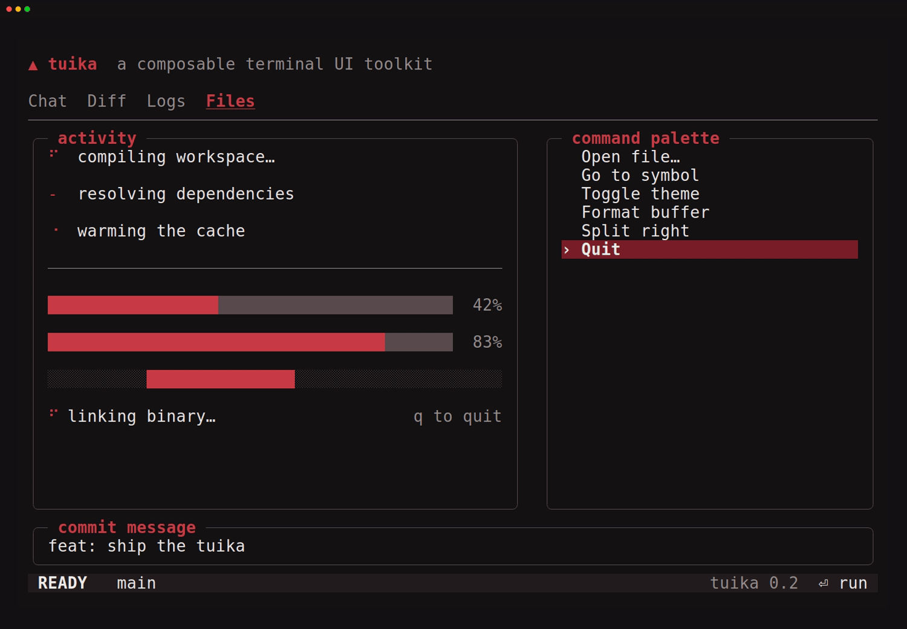

# tuika

[](https://crates.io/crates/tuika)
[](https://docs.rs/tuika)
[](https://crates.io/crates/tuika)
[](https://github.com/everruns/yolop/blob/main/LICENSE)


<p align="center">
  
</p>

A small composable terminal UI toolkit. `tuika` provides the layout,
overlay, focus, and component primitives that `ratatui` leaves to you, while
letting `ratatui` keep ownership of the cell buffer and its diff against the
terminal.

It is a published, self-contained crate that depends only on `ratatui`,
`crossterm`, `textwrap`, `unicode-segmentation`, and `unicode-width`, and is
host-agnostic — it knows nothing about the application embedding it.

## Install

```bash
cargo add tuika
```

`ratatui` and `crossterm` are part of `tuika`'s public interoperability
surface, so pin the same minor versions in your own crate and Cargo will
deduplicate them (see [Compatibility](#compatibility)).

## Model

- **Views** (`view::View`) are rebuilt from application state every frame. This
  is cheap because `ratatui` diffs the resulting cell buffer, so there is no
  reconciler.
- **State** that must survive across frames — scroll offset, selection index,
  focus — lives in host-persisted `*State` structs (the `StatefulWidget`
  idiom), not in the view tree.
- **Live data** (`Live` / `LiveView`) is shared application state read at render
  time. Updates request a redraw from the runner; Tuika does not spawn data
  sources or reconcile a retained widget tree.
- **Layout** is a flexbox subset (`layout`): `Dimension` (`Auto`/`Fixed`/
  `Percent`/`Flex`), `Align`, `Justify`, `Direction`, over a direction-agnostic
  axis so rows and columns share one solver.
- **Overlays** (`overlay`) anchor a view over the base tree; the **host**
  (`host`) owns the alternate screen, translates crossterm input, and
  composites the frame.
- **Motion** (`anim`, `components::{Spinner, ProgressBar, Loader}`,
  `native::TerminalProgress`) animates from a host-supplied frame counter and
  can drive the terminal's own OSC 9;4 progress indicator.

## Components

See the [component gallery](docs/components.md) for an animated demo of each
component. Linked names below jump straight to their demo.

| Component | Purpose |
| --- | --- |
| [`Text`](docs/components.md#text) / `Paragraph` | Styled lines / word-wrapped plain text |
| `Wrap` | Word-wraps pre-styled lines, preserving per-span styles |
| [`Markdown`](docs/components.md#markdown--markdownstate) (+ `MarkdownState`) | CommonMark → styled lines; `MarkdownState` streams incrementally |
| [`CodeBlock`](docs/components.md#codeblock) | Themed, framed code block with a pluggable `Highlighter` |
| [`Rule`](docs/components.md#rule) | Horizontal separator: optional title + fill glyph to width |
| [`Flex`](docs/components.md#flex) | Flexbox container (the composition primitive) |
| `Responsive` / `Constrained` | Breakpoint selection and min/max measurement |
| [`Boxed`](docs/components.md#boxed) | Border + padding + title, focus-aware |
| `Spacer` | Flexible filler |
| [`Scroll`](docs/components.md#scroll--scrollstate) (+ `ScrollState`) | Vertical scroll viewport + scrollbar |
| [`SelectList`](docs/components.md#selectlist--selectstate) (+ `SelectState`) | Selectable list |
| [`StatusBar`](docs/components.md#statusbar) | One-row left/right status segments |
| [`Tabs`](docs/components.md#tabs--tabsstate) / `KeyHints` | Host-state tab navigation and command hints |
| [`Spinner`](docs/components.md#spinner) | Frame-cycled activity glyph |
| [`ProgressBar`](docs/components.md#progressbar) | Determinate (sub-cell) / indeterminate bar |
| [`Loader`](docs/components.md#loader) | Spinner + message + hint row |

## Example

Layout reads top-down with the [`view!`](#declarative-dsl-view) DSL:

```rust
use tuika::{ProgressBar, Spinner, Theme, paint, view};

let theme = Theme::default();
let root = view! {
    col(gap = 1) {
        fixed(1) { node(Spinner::new(frame)) }
        fixed(1) { node(ProgressBar::determinate(0.6).percent(true)) }
        grow(1) { text("body") }
    }
};

// In a `terminal.draw(|f| ...)` closure:
paint(f.buffer_mut(), f.area(), &theme, root.as_ref(), &[]);
```

### Builder syntax (alternative)

`view!` expands to plain builder calls, so the same tree can be written without
the macro:

```rust
use tuika::{Flex, ProgressBar, Spinner, Text, element};

let root = Flex::column()
    .gap(1)
    .fixed(1, element(Spinner::new(frame)))
    .fixed(1, element(ProgressBar::determinate(0.6).percent(true)))
    .grow(1, element(Text::raw("body")));
```

## Markdown and syntax highlighting

`Markdown` renders CommonMark to styled lines, word-wrapping prose while drawing
code and tables verbatim. `MarkdownState` is its streaming form: fed deltas as a
message arrives, it re-parses only the in-flight tail and caches everything
before the last stable block boundary, so long transcripts don't re-tokenize and
settled code blocks aren't re-highlighted every frame.

Highlighting is a seam, not a dependency: `tuika` owns the *presentation* of code
(framing, background, language label, wrapping) via `CodeBlock`, and takes token
colors from any `Highlighter` you supply — keeping the toolkit free of grammar
crates. The companion crate
[`tuika-codeformatters`](https://crates.io/crates/tuika-codeformatters) ships a
ready-made tree-sitter `Highlighter`.

```rust
use tuika::{CodeBlock, Markdown};
use tuika_codeformatters::TreeSitterHighlighter;

let hl = TreeSitterHighlighter::new();
let _doc = Markdown::new("# Title\n\n```rust\nfn main() {}\n```").highlighter(&hl);
let _code = CodeBlock::new("rust", "fn main() {}").highlighter(&hl);
```

### Runnable examples

Each enters the alternate screen; press `q` (or `esc`) to quit.

| Example    | Command                                   | Shows                                              |
| ---------- | ----------------------------------------- | -------------------------------------------------- |
| [`gallery`](examples/gallery.rs)  | `cargo run -p tuika --example gallery`    | motion components + native OSC 9;4 progress        |
| [`markdown`](examples/markdown.rs) | `cargo run -p tuika --example markdown`   | streaming `MarkdownState` + highlighted `CodeBlock` |
| [`select`](examples/select.rs)   | `cargo run -p tuika --example select`     | `SelectState` + `SelectList` (stateful-widget idiom) |
| [`overlay`](examples/overlay.rs)  | `cargo run -p tuika --example overlay`    | `OverlaySpec` centered dialog + input routing      |
| [`ratatui_dashboard`](examples/ratatui_dashboard.rs) | `cargo run -p tuika --example ratatui_dashboard` | mixed Ratatui widgets + responsive live data |
| [`mouse`](examples/mouse.rs)     | `cargo run -p tuika --example mouse`      | drag-to-select + highlight + OSC 52 copy, clickable buttons |

(Embedded in yolop, the gallery is also reachable as `yolop tuika-gallery`.)

## Declarative DSL (`view!`)

`view!` is optional sugar over the builders — it expands to the exact same
`Flex`/`Boxed`/`element(...)` calls, so there is no runtime cost and nothing new
in the model. It just makes nested layout read top-down:

```rust
let root = crate::view! {
    col(gap = 1, padding = tuika::Padding::all(1)) {
        boxed(title = " body ") { text("hello") }
        grow(1) { spacer() }
        node(status_bar)          // any expression that is `impl View`
    }
};
```

Grammar (each keyword consumes exactly one node):

- `col(attrs) { … }` / `row(attrs) { … }` — flex containers. Attrs (all
  optional): `gap`, `padding`, `align`, `justify`, `background`.
- `boxed(attrs) { child }` — bordered container. Attrs: `title`, `border`,
  `padding`, `background`.
- `text(expr)`, `spacer()` — leaves.
- `grow(n) { node }` / `fixed(n) { node }` — set a child's main-axis size
  (default auto).
- **`node(expr)`** — splice any `impl View`. This is the escape hatch, and how
  a component **from another crate** participates in the DSL:

  ```rust
  use other_crate::CustomView;
  crate::view! { col { node(CustomView::new(&data)) } };
  ```

`node(...)` accepts any type that already implements Tuika's `View`; it does
not make a Ratatui `Widget` implement `View`. Use `RatatuiView` for Ratatui
widgets. The `tuika-gallery` demo is built entirely with `view!`.

## Ratatui interoperability

Tuika deliberately does not duplicate Ratatui's widget catalog. Wrap existing
widgets in `RatatuiView`; they render into an isolated buffer and only the
assigned clip is composited into the frame:

```rust
use ratatui::widgets::{Sparkline, Widget};
use tuika::{RatatuiView, Size};

let values = vec![1, 4, 2, 8];
let chart = RatatuiView::sized(Size::new(20, 4), move |area, buffer| {
    Sparkline::default().data(&values).render(area, buffer);
});
```

The closure form supports widgets that borrow captured data. Stateful widgets
can capture host-owned synchronized state and call `StatefulWidget::render`
inside the same closure. `Surface::render_ratatui` is the lower-level escape
hatch for custom views that need several widgets. Neither API exposes the
frame's mutable buffer.

## Responsive and live views

`Responsive` chooses complete compact/wide view trees from the current width;
this supports row-to-column reflow and intentionally omitted secondary
content. `Constrained` supplies min/max intrinsic measurements to flex layout.

`Live<T>` is shared application data with a narrow read/update API. `LiveView`
derives a fresh view from its current value each frame. Connect it to
`Runner::redraw_handle()` when background producers should invalidate the
screen. Producers retain ownership of their threads, tasks, retries, and
lifecycle.

## Terminal lifecycle and runner

`TerminalSession` is the complete RAII guard: it owns raw mode, alternate
screen, mouse capture, and cursor visibility, including rollback after partial
initialization. It preserves raw mode when the caller had already enabled it.
`AltScreen` remains available for hosts that intentionally own raw mode and
cursor visibility themselves.

`Runner` is an optional synchronous event loop for dashboards and small tools.
It owns `TerminalSession`, frame scheduling, Crossterm event translation, and
data-driven redraw checks. Async applications can keep their existing loop and
call `paint` directly.

## Native terminal progress

`native::TerminalProgress` emits the OSC 9;4 sequence, which drives the
terminal's own progress indicator — a bar across the top of the window in
Ghostty, the taskbar in Windows Terminal / ConEmu, and similar in
WezTerm / Konsole / mintty. It is out-of-band (no cursor movement, no cells),
so it works in both the inline and full-screen renderers; terminals that don't
understand it ignore the sequence. yolop shows it (indeterminate) while a turn
runs and clears it when idle.

## Mouse, selection, and clipboard

Enabling mouse capture (which `AltScreen` / `TerminalSession` do) means the
terminal stops doing its own click-drag text selection and hands every drag to
the app instead. The `mouse` module rebuilds those affordances over the grid
you already rendered:

- **Text selection.** `SelectionState` turns a left-button `Down → Drag → Up`
  gesture into a `SelectionRange` (a plain click selects nothing; a new press
  clears the old selection). `selected_text(buffer, area, range)` reads the text
  back out of the rendered `ratatui::Buffer` — linear/stream selection like a
  terminal's own, wide glyphs intact — and `highlight(buffer, area, range,
  style)` paints it in.
- **Clicks and regions.** `HitMap<T>` maps screen rects to values (a button, a
  link, a row); the last-pushed match wins, so children/overlays registered
  after their parents take precedence. `ClickTracker` turns a same-cell
  `Down`/`Up` into a `Click` and lets an intervening drag cancel it.
- **Clipboard.** `clipboard::write_clipboard(out, text)` copies via **OSC 52**
  (`clipboard::osc52` is the pure encoder) — no platform clipboard library,
  works over SSH. Same tmux caveat as OSC 8: needs `allow-passthrough on`.

The enriched event model carries what selection and clicks need: `MouseKind` is
`Down/Up/Drag(MouseButton)`, `Moved`, and `ScrollUp/Down/Left/Right`, and every
`Mouse` reports `shift/ctrl/alt`. **Shift-drag** is deliberately left to the
terminal — most emulators use it to bypass app mouse capture for a native
selection — so a host should act on `plain()` left-drags.

**Touch** arrives as mouse events: terminal emulators translate a tap to a
`Down`+`Up` and a swipe to scroll or a drag, so touch flows through this same
path — there is no separate touch event to handle.

## Testing your UI

Rendering is deterministic, so UI built on tuika can be tested without a real
terminal or `TestBackend` setup. The [`testing`](https://docs.rs/tuika/latest/tuika/testing/index.html)
module draws a `View` into an in-memory ratatui `Buffer` and reads it back:

- `render(view, width, height, &theme) -> Buffer` — draw once at a fixed size.
- `grid(&buffer) -> String` — the buffer as a plain glyph grid, ready for a
  snapshot assertion.
- `render_sizes(view, sizes, &theme) -> Vec<Buffer>` — the same view across a set
  of sizes, for resize and degenerate-size sweeps.

```rust
use tuika::testing::{grid, render};
use tuika::Theme;

let buffer = render(my_view.as_ref(), 20, 3, &Theme::default());
assert!(grid(&buffer).contains("expected text"));
```

## Used in

- [**yolop**](https://github.com/everruns/yolop) — a terminal coding agent whose
  experimental full-screen renderer is built on tuika.

Building something on tuika? Open a PR adding it here.

## Compatibility

- Minimum supported Rust version: **1.88**, declared as `rust-version` and
  checked in CI.
- Tuika 0.x follows Cargo semver: minor releases may make deliberate breaking
  API changes; patch releases do not.
- Ratatui and Crossterm are part of Tuika's public interoperability surface.
  Tuika tracks compatible minor lines deliberately; applications should use
  matching versions so Cargo can deduplicate them.

## Extending

tuika is extended from your own crate — no fork, no registration step, no trait
the built-ins get that yours don't:

- **Custom components.** Implement [`View`](https://docs.rs/tuika/latest/tuika/trait.View.html)
  on your own type and splice it anywhere with `node(your_view)`, or hand it to
  any container — they accept any `impl View`. The built-in components are on
  equal footing with yours; nothing special-cases them.
- **Existing Ratatui widgets.** Wrap one in `RatatuiView` rather than
  reimplementing it — see [Ratatui interoperability](#ratatui-interoperability).

The [`view!`](#declarative-dsl-view) DSL reaches your components through the same
`node(...)` escape hatch, so they compose exactly like the built-ins.
