# tuika component gallery

A visual catalog of tuika's components — each with a name, a one-line
description, and an animated demo.

## Motion

Animated from a host-supplied frame counter (see the [`anim`](https://docs.rs/tuika/latest/tuika/anim/index.html) module).

### `Spinner`

A frame-cycled activity glyph — `Braille` (smooth default), `Line` (ASCII
fallback), or `Dots`. [API](https://docs.rs/tuika/latest/tuika/struct.Spinner.html)

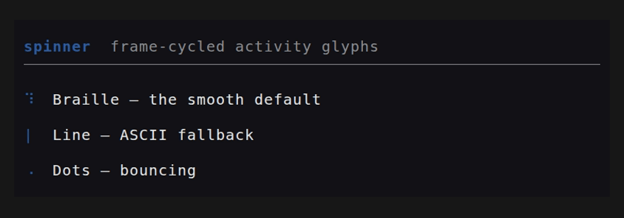

```rust
use tuika::{Spinner, SpinnerStyle, view};
view! {
    row(gap = 1) {
        node(Spinner::new(frame).style(SpinnerStyle::Braille))
        text("working…")
    }
}
```

### `ProgressBar`

A single-row bar: determinate (sub-cell eighth-block fill, optional `NN%`) or an
indeterminate marquee driven by the frame counter.
[API](https://docs.rs/tuika/latest/tuika/struct.ProgressBar.html)

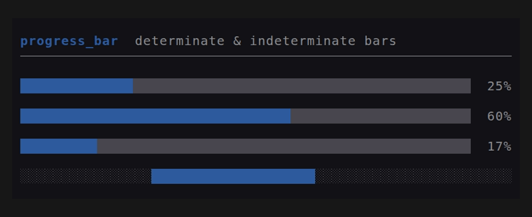

```rust
use tuika::{ProgressBar, view};
view! {
    col(gap = 1) {
        node(ProgressBar::determinate(0.6).percent(true))
        node(ProgressBar::indeterminate(frame))
    }
}
```

### `Loader`

A spinner, a message, and an optional trailing hint on one row.
[API](https://docs.rs/tuika/latest/tuika/struct.Loader.html)

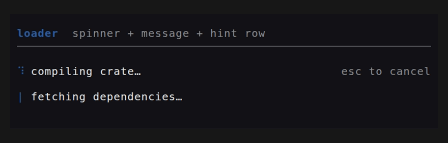

```rust
use tuika::{Loader, view};
view! {
    node(Loader::new(frame, "compiling crate…").hint("esc to cancel"))
}
```

## Text

### `Text`

A block of pre-styled [`Line`](https://docs.rs/ratatui)s drawn top-down and
clipped. `Paragraph` word-wraps plain text in one style; `Wrap` word-wraps
pre-styled lines while preserving per-span styles.
[API](https://docs.rs/tuika/latest/tuika/struct.Text.html)

Horizontal alignment is honored. `Text` and `Wrap` read each `Line`'s
`alignment` (unset = flush-left), so centered titles, right-aligned totals, and
centered empty-state messages built by an existing formatting layer render as
intended; `Wrap` carries a line's alignment onto every reflowed row.
`Paragraph` takes one alignment for the whole block via `.alignment(..)`.

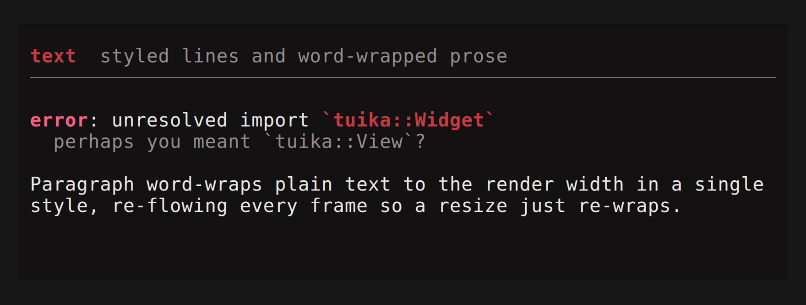

```rust
use ratatui::layout::Alignment;
use ratatui::text::Line;
use tuika::{Paragraph, Text, view};
view! {
    col(gap = 1) {
        // Per-line alignment on pre-styled lines.
        node(Text::new(vec![
            Line::from("flush left"),
            Line::from("centered").centered(),
            Line::from("flush right").right_aligned(),
        ]))
        // One alignment for a wrapped plain-text block.
        node(Paragraph::new("word-wrapped prose", style).alignment(Alignment::Center))
    }
}
```

### `Rule`

A one-row horizontal separator: optional leading title, then a fill glyph out to
the width. [API](https://docs.rs/tuika/latest/tuika/struct.Rule.html)

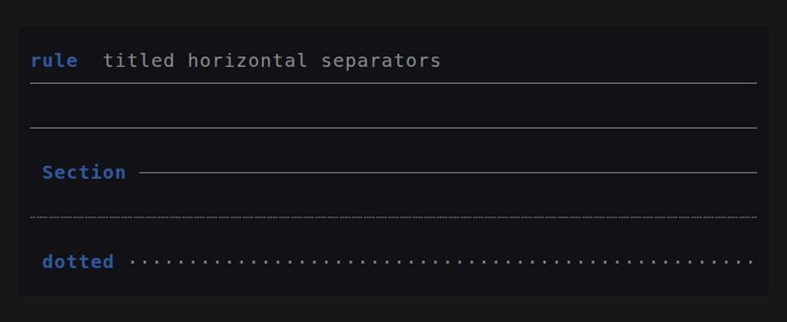

```rust
use tuika::{Rule, view};
view! {
    node(Rule::new().title(" Section "))
}
```

## Markdown & code

### `Markdown` + `MarkdownState`

Renders CommonMark (plus GFM tables and strikethrough) to styled lines —
word-wrapping prose and re-laying-out code and tables to the render width.
`MarkdownState` is the streaming form: fed deltas as a message arrives, it
re-parses only the in-flight tail and caches everything before the last stable
block boundary, so long transcripts don't re-tokenize. The cache holds
width-independent parsed blocks, so layout (including table column fitting) is
recomputed each frame — pass the current width and the output tracks the view
as it resizes.
[API](https://docs.rs/tuika/latest/tuika/struct.Markdown.html)

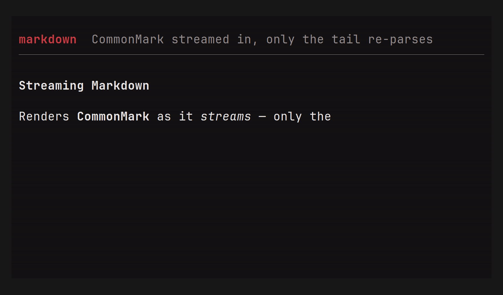

```rust
use tuika::{CodeHighlighter, MarkdownState, Theme, view};
let theme = Theme::default();
let mut md = MarkdownState::new();
md.push_str(delta);                                  // forward each stream delta
let lines = md.lines(width, &theme, CodeHighlighter::Plain);
view! { node(tuika::Text::new(lines)) }
```

#### GFM tables

Pipe tables render with box-drawing borders, a bold header, and per-column
alignment from the `:---:` markers. Columns size to their content, then shrink
the widest column (wrapping its cells) to fit the available width; when even
that won't fit — below `4 * cols + 1` columns — the box is dropped for
` | `-joined rows that word-wrap. Because layout is width-driven, the same
source reflows as the view resizes.

```rust
use tuika::Markdown;
let doc = Markdown::new("\
| Component | Kind        | Resizes |
| :-------- | :---------: | ------: |
| Markdown  | streaming   |     yes |
| CodeBlock | static      |     yes |
");
// Wide area: full boxed grid.        Narrow area: same source, boxless fallback.
// ╭───────────┬───────────┬─────────╮   Component | Kind | Resizes
// │ Component │    Kind   │ Resizes │   Markdown | streaming | yes
// │ Markdown  │ streaming │     yes │   CodeBlock | static | yes
// ╰───────────┴───────────┴─────────╯
# let _ = doc;
```

### `CodeBlock`

A themed, syntax-highlighted fenced block: a language label, a left rail, and a
code background. Highlighting comes from a pluggable `Highlighter` (none → plain,
theme-colored text); the `tuika-codeformatters` crate ships a tree-sitter one.
[API](https://docs.rs/tuika/latest/tuika/struct.CodeBlock.html)

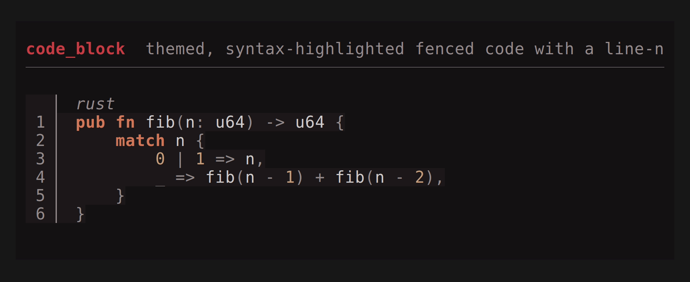

```rust
use tuika::{CodeBlock, view};
view! {
    node(CodeBlock::new("rust", "fn main() {}").highlighter(&highlighter))
}
```

## Layout

### `Flex`

The flexbox container and composition primitive — `grow(n)` children share
leftover space by weight, `fixed(n)` reserve exact size, with `gap` and
`padding`. It *is* the `view!` DSL's `row`/`col`.
[API](https://docs.rs/tuika/latest/tuika/struct.Flex.html)

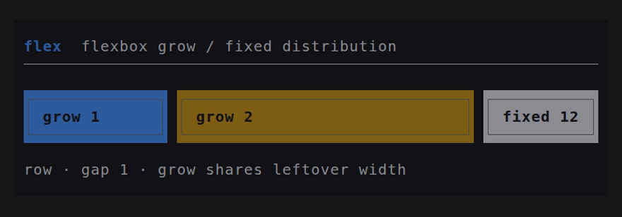

```rust
use tuika::view;
view! {
    row(gap = 1) {
        grow(1) { node(left) }
        fixed(12) { node(right) }
    }
}
```

Need the child rects *before* (or without) painting — to size a scroll region
to a pane's real height, hit-test a click, or decide what fits? `Flex::solve`
runs the same measure-then-solve pass render uses and returns one `Rect` per
child, painting nothing. The underlying flexbox solver is also callable directly
as `tuika::solve(area, &style, &items)` for layouts built without a `Flex`.

```rust
use tuika::{Flex, Text, element};
use ratatui::layout::Rect;

let flex = Flex::row()
    .fixed(8, element(Text::raw("sidebar")))
    .grow(1, element(Text::raw("content")));
let rects = flex.solve(Rect::new(0, 0, 40, 10)); // [sidebar_rect, content_rect]
```

### `Boxed`

A border + padding + title wrapping one child. The border color is focus-aware
by default (theme `border` / `border_focused`); `border_color(Color)` overrides
that with an explicit color for semantic frames — an accent or danger modal, or
a per-pane color a host resolves itself. An optional `title_bottom` rides the
bottom border — the slot for a `1 of 3` position counter, a footer legend, or a
hint. Both titles honor their `Line` alignment; unset, the top title is
flush-left and the bottom title flush-right.
[API](https://docs.rs/tuika/latest/tuika/struct.Boxed.html)

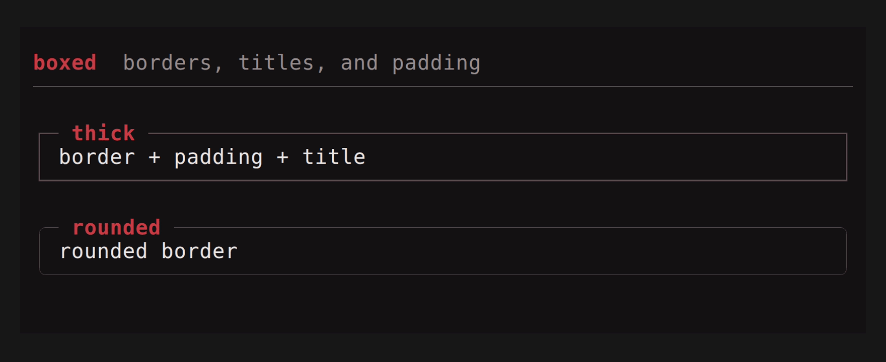

```rust
use tuika::{BorderStyle, view};
view! {
    boxed(title = " title ", title_bottom = " 1/3 ", border = BorderStyle::Rounded) {
        node(child)
    }
}
```

### `FocusScope`

A layout-transparent wrapper that renders its subtree with an explicit focus
flag. Focus lives on the render context and `paint` uses one root context, so a
`Flex` can't hand a single child `focused = true`; wrap each pane in a
`FocusScope` so the active one's `Boxed` border lights up while the others stay
dim — independently of the frame's root focus.
[API](https://docs.rs/tuika/latest/tuika/struct.FocusScope.html)

```rust
use tuika::{Boxed, FocusScope, Text, element, view};
view! {
    row(gap = 1) {
        grow(1) { node(FocusScope::focused(element(Boxed::new(element(Text::raw("active")))))) }
        grow(1) { node(FocusScope::unfocused(element(Boxed::new(element(Text::raw("idle")))))) }
    }
}
```

### `StatusBar`

One row with left- and right-anchored segment groups.
[API](https://docs.rs/tuika/latest/tuika/struct.StatusBar.html)

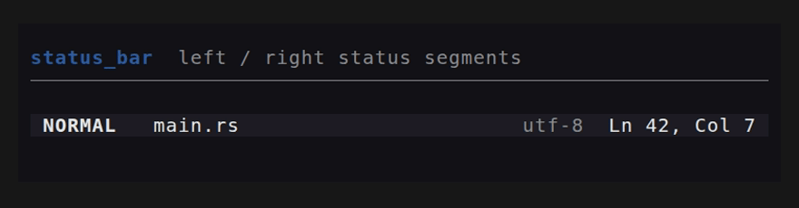

```rust
use tuika::{StatusBar, view};
view! {
    node(StatusBar::new().left(left_spans).right(right_spans))
}
```

## Interactive

Each pairs a rendered view with a host-persisted `*State` (the
`StatefulWidget` idiom): the state owns cursor/offset/selection and handles
events, the view borrows it for a frame.

### `Scroll` + `ScrollState`

A windowed view over long content with a scrollbar; `ScrollState` handles
paging, wheel scroll, and stick-to-bottom. The offset is also **host-drivable**:
`set_offset(n)` mirrors an app-owned scroll position into the view — the
vertical peer of `SelectState::select` — for event-loop apps that track their
own position.
[API](https://docs.rs/tuika/latest/tuika/struct.Scroll.html)

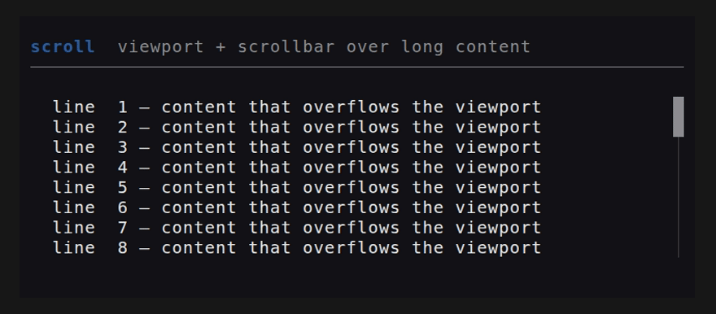

```rust
use tuika::{Scroll, ScrollState, view};
let mut state = ScrollState::new();          // held by the host across frames
state.handle(&event, content_h, viewport_h); // built-in wheel/paging, or…
state.set_offset(app.scroll_row);            // …mirror an app-owned position
view! { node(Scroll::new(lines, &state)) }
```

### `SelectList` + `SelectState`

A selectable list; `SelectState` navigates with the arrow keys (wrapping),
confirms on Enter, cancels on Esc.
[API](https://docs.rs/tuika/latest/tuika/struct.SelectList.html)

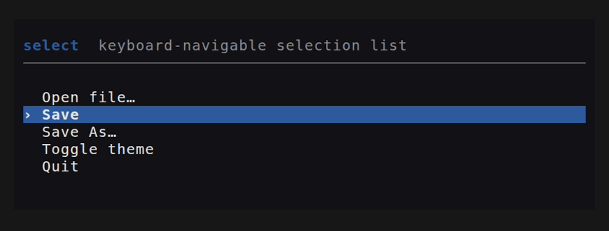

```rust
use tuika::{SelectList, SelectState, view};
let mut state = SelectState::new();
state.handle(&event, items.len());
view! { node(SelectList::new(items, &state)) }
```

### `Table` + `SelectState`

The multi-column peer of `SelectList` — the widget behind repo/branch/worktree
browsers, process and container lists, and file explorers: a header row,
per-column width policy, a full-row selection highlight, a caret gutter, and
windowed scrolling. Column widths come from the same flexbox `solve` as every
other container — a `Column` is `fixed`, `auto` (widest cell), or `flex`
(shares leftover width). Selection reuses `SelectState`, so a list and a table
share one state type.
[API](https://docs.rs/tuika/latest/tuika/struct.Table.html)

```rust
use ratatui::text::Line;
use tuika::{Column, Table, SelectState, view};
let mut state = SelectState::new();
state.handle(&event, rows.len());
let columns = vec![Column::auto("branch"), Column::fixed("ahead", 5), Column::flex("subject", 1)];
view! { node(Table::new(columns, rows, &state).viewport(20)) }
```

### `Tabs` + `TabsState`

A one-line tab strip; `TabsState` handles left/right and tab navigation.
[API](https://docs.rs/tuika/latest/tuika/struct.Tabs.html)

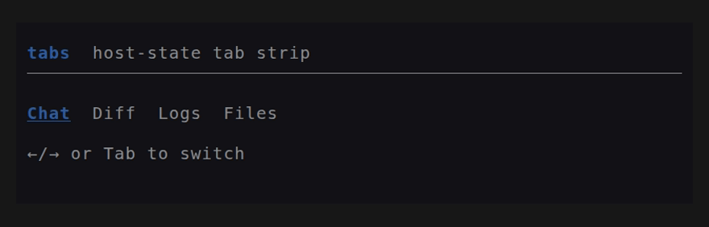

```rust
use tuika::{Tabs, TabsState, view};
let mut state = TabsState::default();
state.handle(&event, labels.len());
view! { node(Tabs::new(labels, &state)) }
```

### `TextInput` + `TextInputState`

A multi-line edit model: buffer, cursor, editing, and soft-wrap. `TextInput`
renders a snapshot; the host places the terminal cursor from
`TextInputState::cursor_screen`.
[API](https://docs.rs/tuika/latest/tuika/struct.TextInput.html)

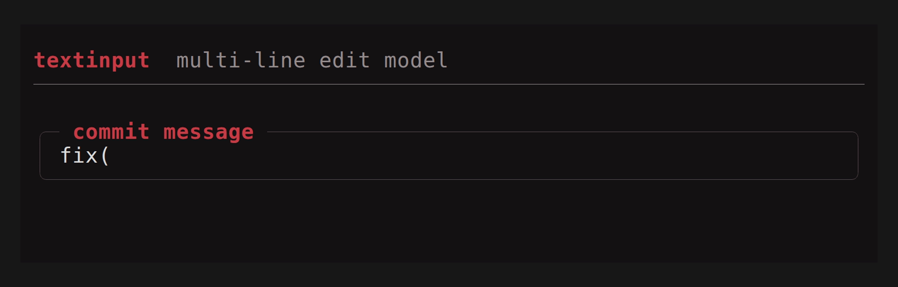

```rust
use tuika::{TextInput, TextInputState, view};
let state = TextInputState::from_text("");
view! {
    boxed(title = " commit message ") {
        node(TextInput::new(&state))
    }
}
```

## See also

- [API documentation](https://docs.rs/tuika) — the complete component reference,
  including helpers without a standalone demo (`Spacer`, `Responsive`,
  `Constrained`, `Wrap`, `KeyHints`).
- [Runnable examples](../examples/) — enter the alternate screen; quit with `q`/`esc`.
- [README](../README.md) — the model behind the toolkit.
