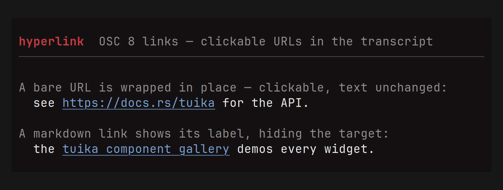
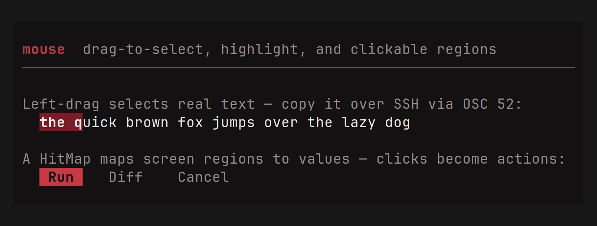
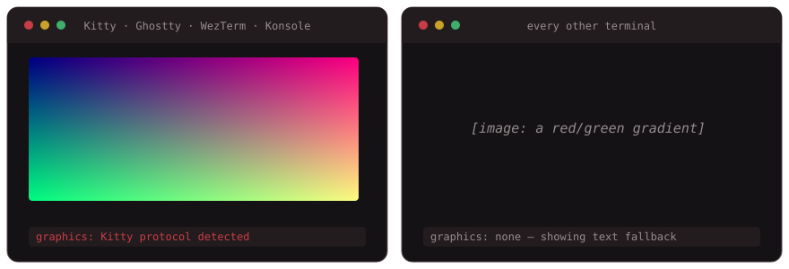

# tuika terminal features

Cross-cutting terminal capabilities that sit outside the [component
gallery](components.md): the *out-of-band* escape sequences tuika speaks to the
terminal itself — clickable links, native progress, the system clipboard — and
the mouse model that turns pointer input into selections and clicks.

These are terminal features, not widgets. Where a component paints cells,
several of these emit an OSC (Operating System Command) sequence the terminal
interprets directly. That has one consequence worth stating up front: a
terminal that understands the sequence acts on it; one that does not silently
ignores the unknown OSC, so the feature degrades to plain text or a no-op
rather than leaking escape codes onto the screen.

## Hyperlinks (OSC 8)

Turn a bare `http(s)` URL into a real clickable link, in place, without changing
the visible text. A cell buffer can't carry a link target — a `ratatui::Cell`
is one grapheme plus a style — so tuika emits the link by writing the OSC 8
sequence around the run instead of through the buffer.
[API](https://docs.rs/tuika/latest/tuika/hyperlink/index.html)



There are two entry points:

- `osc8(url, text)` — the pure encoder. Returns `text` wrapped in the OSC 8
  sequence, or `text` unchanged when `url` isn't a safe web URL. No I/O.
- `write_line(out, line)` — serialize a `ratatui::Line` (colors, modifiers, and
  OSC 8 links) straight to a writer, so a host can push a transcript line to
  scrollback with live links instead of routing it through the cell buffer.
- `HyperlinkBackend` — a `ratatui::Backend` wrapper that scans drawn cell runs
  for URLs and wraps just those in OSC 8, so links work inside the normal render
  path too. When disabled it's a zero-cost pass-through.

Each has a policy-aware sibling — `osc8_with`, `write_line_with`, and
`HyperlinkBackend::with_policy` — taking a `LinkPolicy` so the host chooses which
schemes are linked. The default (`LinkPolicy::WEB`) is `http(s)`-only;
`LinkPolicy::WEB.with_mailto()` also links `mailto:` addresses.

```rust
use tuika::{osc8, is_web_url};

// Pure encoder — safe to unit-test, no terminal needed.
let link = osc8("https://docs.rs/tuika", "the tuika docs");

// A bare URL a host would style and hand to `write_line` as a link run.
assert!(is_web_url("https://docs.rs/tuika"));
```

The emitted bytes (`ST` is the string terminator `ESC \`):

```text
ESC ] 8 ; ; https://docs.rs/tuika ST   the tuika docs   ESC ] 8 ; ; ST
```

**Supported terminals:** Ghostty, iTerm2, WezTerm, Kitty, recent VTE-based
terminals. Others render the visible text unchanged.

**Limits & safety.** The scheme allowlist is the safety boundary: by default
only `http://` and `https://` are accepted, and a host that opts into `mailto:`
gets it sanitized separately — the query (`?cc=`, `?body=`, …) is dropped so a
click can't be steered into pre-filled headers. Every accepted target has its
control characters stripped (including the `ESC`/`BEL` that could break out of
the sequence), so a crafted URL can't escape the OSC. Under tmux, passthrough
must be enabled: `set -g allow-passthrough on`.

## Mouse: selection, highlight & clicks

Once an app captures the mouse, the terminal stops doing its own click-drag text
selection. The `mouse` module rebuilds those affordances over the grid you
already rendered — selection, copy, and hit-testing — from tuika's enriched
event model (`MouseKind` carries `Down`/`Up`/`Drag`, `Moved`, and scroll, with
`shift`/`ctrl`/`alt`).
[API](https://docs.rs/tuika/latest/tuika/mouse/index.html)



- `SelectionState` turns a left-button `Down → Drag → Up` gesture into a
  `SelectionRange`, and a same-cell double click selects the word under the
  pointer. Call `resolve(buffer, area)` after rendering to resolve pending word
  boundaries; `selected_text(buffer, area, range)` then reads the selected text
  back out of the rendered buffer (wide glyphs intact) and `highlight(buffer,
  area, range, style)` paints it in.
- `ctrl_click_url(event, buffer, area)` returns the visible bare `http://` or
  `https://` URL under a Ctrl+left-button release. The host remains responsible
  for opening it; Yolop's fullscreen host opens it in the system browser.
- `HitMap<T>` maps screen rects to values (a button, a link, a row); the
  last-pushed match wins, so children and overlays registered after their
  parents take precedence. `ClickTracker` turns a same-cell `Down`/`Up` into a
  `Click` and lets an intervening drag cancel it.

```rust
use tuika::mouse::{SelectionState, selected_text};

let mut sel = SelectionState::new();   // held by the host across frames
sel.handle(&mouse);                    // feed each mouse event
if let Some(range) = sel.range() {
    let text = selected_text(&buffer, area, range);
    // …copy `text` to the clipboard (see below)
}
```

Selection integrates with the clipboard feature below: the text a drag selects
is exactly what `write_clipboard` copies. **Shift-drag** is deliberately left to
the terminal so its native selection still works as an escape hatch.

## System clipboard (OSC 52)

Copy text to the system clipboard by writing an OSC 52 sequence — the *terminal*
does the copy, so there's no platform clipboard library and it works over SSH.
That makes it the natural partner to a mouse selection.
[API](https://docs.rs/tuika/latest/tuika/clipboard/index.html)

- `osc52(text)` — pure encoder; returns the sequence, or `None` when `text` is
  empty or exceeds `MAX_LEN`.
- `write_clipboard(out, text)` — encode and write in one step, returning whether
  a sequence was emitted.

```rust
use tuika::write_clipboard;

let mut out = std::io::stdout();
let copied = write_clipboard(&mut out, "selected text")?;   // Ok(true) when emitted
```

The emitted bytes are the base64-encoded payload, terminated by `ST` (`ESC \`):

```text
ESC ] 52 ; c ; <base64-of-text> ST
```

**Supported terminals:** Ghostty, iTerm2 (with clipboard writes enabled),
WezTerm, Kitty, recent VTE, xterm.

**Limits.** Terminals cap the sequence near 100 000 bytes, so a single copy is
bounded at `MAX_LEN` (74 994 bytes); longer text is refused rather than sent
truncated — a truncated clipboard is worse than a failed copy. Under tmux it
needs `set -g allow-passthrough on` (or tmux's own `set-clipboard`), the same
passthrough caveat as OSC 8.

## Native progress (OSC 9;4)

Drive the terminal's *own* progress indicator — a bar across the window in
Ghostty, the taskbar in Windows Terminal and ConEmu. It's fully out-of-band: it
moves no cursor and paints no cells, so it works in both the inline and
full-screen renderers and composes with an in-grid
[`ProgressBar`](components.md#progressbar).
[API](https://docs.rs/tuika/latest/tuika/struct.TerminalProgress.html)

`TerminalProgress` owns the indicator and clears it on drop, so a dropped or
panicking session never leaves a stuck bar in the taskbar. Its methods map to
the indicator states: `percent` (normal), `error`, `indeterminate`, and
`clear`.

```rust
use tuika::TerminalProgress;

let mut progress = TerminalProgress::new();
progress.percent(60);        // 60% on the terminal's own bar
// progress.indeterminate(); // busy, percent ignored
// progress.error(60);       // error state at 60%
// …dropping `progress` clears the indicator.
```

The emitted bytes (`state` is 0–4, `percent` is 0–100; terminated by `BEL`):

```text
ESC ] 9 ; 4 ; <state> ; <percent> BEL
```

**Supported terminals:** Ghostty (bar across the top of the window), Windows
Terminal and ConEmu (taskbar), WezTerm, Konsole, mintty. Others swallow the
unknown OSC. Writes are best-effort — a failed progress write never disrupts the
session.

## Images (Kitty & iTerm2 graphics protocols)

Paint real pixels — an avatar, a chart, a rendered diagram — over the cells a
view reserves for them, using the **Kitty graphics protocol** or the **iTerm2
inline-image protocol**, whichever the terminal speaks.
[API](https://docs.rs/tuika/latest/tuika/image/index.html)



Unlike the other demos, this one is generated from the real render rather than
recorded — VHS captures through xterm.js, which doesn't implement the Kitty
graphics protocol, so it can't show the pixels. The picture above is the actual
RGBA the component transmits; the fallback panel is the exact placeholder string
it paints.

Images are the one out-of-band feature that does **not** degrade harmlessly on
its own: a terminal that can't read the graphics escape may paint the payload as
garbage rather than swallowing it. So this is the only feature gated on real
capability detection — `ImageSupport::detect()` reads the environment (`TERM`,
`TERM_PROGRAM`, `KITTY_WINDOW_ID`, the Ghostty marker) and defaults to *no*
graphics, where the same `Image` view falls back to an alt-text placeholder.

Decoding stays in the host (it's a heavy dependency, kept out of tuika like
syntax highlighting is): a host hands in raw RGBA via `ImageData::from_rgba`,
and tuika encodes it for whichever protocol the terminal wants — raw RGBA for
Kitty, an in-tuika PNG for iTerm2 — with no image-codec dependency. Because a
graphics escape paints at the cursor — unlike the cursor-neutral OSC sequences
above — emission is a two-step draw:

- `Image` reserves a `cols × rows` cell footprint and, on render, records its
  placement into a shared `ImageLayer` (the ownership shape of `RectProbe`).
- **After** `terminal.draw()` flushes the frame, `ImageLayer::emit(out)` writes
  each image's escape at its cell origin, bracketed by a cursor save/restore so
  ratatui's cursor model is undisturbed. Then `ImageLayer::clear()` resets it
  for the next frame.

```rust
use tuika::{Image, ImageData, ImageLayer, ImageSupport};

let data = ImageData::from_rgba(2, 2, vec![0u8; 2 * 2 * 4]).unwrap();
let layer = ImageLayer::new();
let _image = Image::new(data, 20, 10)      // 20×10 cells on screen
    .support(ImageSupport::detect())
    .in_layer(&layer)
    .alt("a 2×2 swatch");                  // shown where graphics aren't supported
```

The emitted bytes per protocol (base64 payload; `ST` is `ESC \`, `BEL` is
`0x07`). Kitty carries raw RGBA (`f=32`), chunked, with `q=2` suppressing the
terminal's replies so they aren't read as input:

```text
ESC _ G f=32,s=<px_w>,v=<px_h>,a=T,c=<cols>,r=<rows>,q=2,m=<more> ; <base64> ST
```

iTerm2 carries a PNG file sized in cells:

```text
ESC ] 1337 ; File=inline=1;width=<cols>;height=<rows>;preserveAspectRatio=0;size=<bytes> : <base64> BEL
```

**Supported terminals:** Kitty, Ghostty, WezTerm, Konsole (Kitty protocol);
iTerm2 (its own protocol). Others show the alt-text fallback. See the `image`
example (`cargo run -p tuika --example image`).

Markdown `` renders too. The [`Markdown`](components.md) view's
`.images(resolver, support, layer)` takes a host `ImageResolver` (URL →
`ImageData` — markdown carries only the URL, never pixels, exactly like the code
`Highlighter` seam), reserves a block for each resolved image, and paints it with
the same `Image` machinery — real pixels where supported, alt text otherwise.
Unresolved images stay a marked, link-styled inline placeholder rather than
dropping the URL. (Pixels in the *streaming* `MarkdownState`, and the Sixel
protocol, are the remaining follow-ups.)

## See also

- [Component gallery](components.md) — the widgets that paint the grid.
- [API documentation](https://docs.rs/tuika) — the complete reference for the
  `hyperlink`, `mouse`, `clipboard`, `native`, and `image` modules.
- [Runnable examples](../examples/) — `mouse` records the selection/clipboard
  workflow live; quit with `q`/`esc`.
- [README](../README.md) — the model behind the toolkit.
