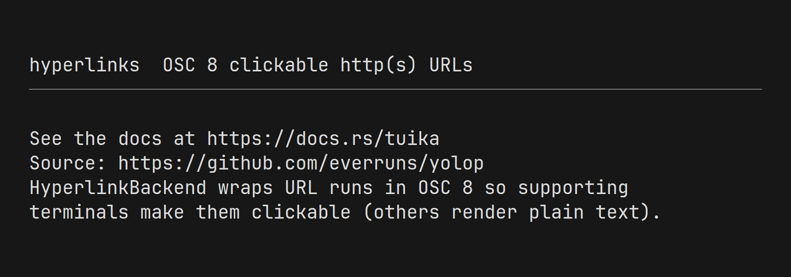
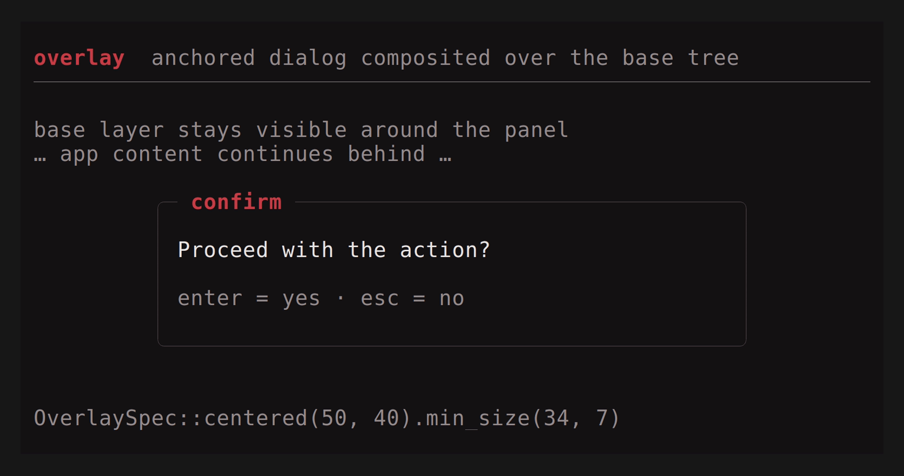

# tuika features

A guided tour of tuika's main capabilities — each with a short description
and, where it helps, an animated demo (same recordings as the
[component gallery](components.md)).

## Progress

### In-cell progress bar

Determinate bars fill by eighth-block glyphs (sub-cell precision); indeterminate
bars slide a marquee from the host frame counter.
[API](https://docs.rs/tuika/latest/tuika/struct.ProgressBar.html)


```rust
use tuika::{ProgressBar, view};
view! {
    col(gap = 1) {
        node(ProgressBar::determinate(0.6).percent(true))
        node(ProgressBar::indeterminate(frame))
    }
}
```

### Native terminal progress (OSC 9;4)

[`TerminalProgress`](https://docs.rs/tuika/latest/tuika/struct.TerminalProgress.html)
drives the emulator's own progress indicator (Ghostty window bar, Windows
Terminal / ConEmu taskbar, WezTerm / Konsole / mintty). It is out-of-band — no
cells, no cursor movement — so terminals that ignore the sequence are
unaffected.

```rust
use tuika::{ProgressState, TerminalProgress};

let mut progress = TerminalProgress::new();
progress.indeterminate();
progress.percent(42);
// Drop clears the indicator so a stuck bar never lingers.
```

### Loader row

Spinner + message + optional hint on one row.
[API](https://docs.rs/tuika/latest/tuika/struct.Loader.html)


```rust
use tuika::{Loader, view};
view! {
    node(Loader::new(frame, "compiling crate…").hint("esc to cancel"))
}
```

## Hyperlinks (OSC 8)

[`HyperlinkBackend`](https://docs.rs/tuika/latest/tuika/struct.HyperlinkBackend.html)
wraps `http(s)` URL runs in the OSC 8 sequence so supporting terminals
(Ghostty, iTerm2, WezTerm, Kitty, recent VTE) make them clickable. Others
ignore the escape and render the URL as plain text.
[`osc8`](https://docs.rs/tuika/latest/tuika/fn.osc8.html) /
[`write_line`](https://docs.rs/tuika/latest/tuika/fn.write_line.html) are the
pure encoder and styled-line sink for hosts that write outside the cell buffer.



```rust
use tuika::HyperlinkBackend;
use ratatui::Terminal;

let backend = HyperlinkBackend::new(std::io::stdout(), true);
let mut terminal = Terminal::new(backend)?;
// Render as usual — URL runs in the buffer become OSC 8 links on draw.
```

## Motion

Frame-cycled activity glyphs driven by a host-supplied counter (see
[`anim`](https://docs.rs/tuika/latest/tuika/anim/index.html)).


```rust
use tuika::{Spinner, SpinnerStyle, view};
view! {
    row(gap = 1) {
        node(Spinner::new(frame).style(SpinnerStyle::Braille))
        text("working…")
    }
}
```

## Layout

Flexbox composition (`grow` / `fixed` / `gap` / `padding`), bordered panels, and
status chrome.

### Flex


```rust
use tuika::view;
view! {
    row(gap = 1) {
        grow(1) { node(left) }
        fixed(12) { node(right) }
    }
}
```

### Boxed


```rust
use tuika::{BorderStyle, view};
view! {
    boxed(title = " title ", border = BorderStyle::Rounded) {
        node(child)
    }
}
```

### Status bar


```rust
use tuika::{StatusBar, view};
view! {
    node(StatusBar::new().left(left_spans).right(right_spans))
}
```

## Overlays

[`OverlaySpec`](https://docs.rs/tuika/latest/tuika/struct.OverlaySpec.html)
anchors a view over the base tree (center, edges, corners) with size as cells
or percent of the screen. [`paint`](https://docs.rs/tuika/latest/tuika/fn.paint.html)
composites overlays last; the host routes input to whichever layer owns focus.



```rust
use tuika::{Overlay, OverlaySpec, paint};

let rect = OverlaySpec::centered(50, 40).min_size(34, 7).resolve(area);
paint(buffer, area, &theme, base.as_ref(), &[Overlay {
    area: rect,
    view: dialog.as_ref(),
    clear: true,
}]);
```

## Interactive state

Host-persisted `*State` structs (the `StatefulWidget` idiom) own cursor,
selection, and scroll offset across frames.

### Scroll


### Select list


### Tabs


### Text input


## Mouse, selection, and clipboard

With mouse capture enabled (`TerminalSession` / `AltScreen`), the terminal hands
drags to the app. Tuika rebuilds the usual affordances:

- **Selection** — [`SelectionState`](https://docs.rs/tuika/latest/tuika/struct.SelectionState.html)
  turns `Down → Drag → Up` into a range; [`highlight`](https://docs.rs/tuika/latest/tuika/fn.highlight.html) /
  [`selected_text`](https://docs.rs/tuika/latest/tuika/fn.selected_text.html)
  paint and extract it from the rendered buffer.
- **Clicks** — [`HitMap`](https://docs.rs/tuika/latest/tuika/struct.HitMap.html) +
  [`ClickTracker`](https://docs.rs/tuika/latest/tuika/struct.ClickTracker.html)
  map rects to values and distinguish click from drag.
- **Clipboard** — [`write_clipboard`](https://docs.rs/tuika/latest/tuika/fn.write_clipboard.html)
  copies via OSC 52 (works over SSH; tmux needs `allow-passthrough on`).

```rust
use tuika::{ClickTracker, HitMap, SelectionState, highlight, selected_text, write_clipboard};

sel.handle(&event);
if let Some(range) = sel.range() {
    highlight(buffer, area, range, sel_style);
    write_clipboard(&mut out, &selected_text(buffer, area, range))?;
}
```

See `cargo run -p tuika --example mouse`.

## Live data and responsive layout

[`Live`](https://docs.rs/tuika/latest/tuika/struct.Live.html) /
[`LiveView`](https://docs.rs/tuika/latest/tuika/struct.LiveView.html) read shared
application state each frame and request redraws through
[`RedrawHandle`](https://docs.rs/tuika/latest/tuika/struct.RedrawHandle.html).
[`Responsive`](https://docs.rs/tuika/latest/tuika/struct.Responsive.html) picks
compact vs wide view trees by width;
[`Constrained`](https://docs.rs/tuika/latest/tuika/struct.Constrained.html)
feeds min/max measurements into flex.

## Declarative `view!` DSL

Optional sugar over the builders — expands to the same `Flex` / `Boxed` /
`element(...)` calls:

```rust
let root = tuika::view! {
    col(gap = 1, padding = tuika::Padding::all(1)) {
        boxed(title = " body ") { text("hello") }
        grow(1) { spacer() }
        node(status_bar)
    }
};
```

## Ratatui interoperability

Wrap existing widgets in
[`RatatuiView`](https://docs.rs/tuika/latest/tuika/struct.RatatuiView.html);
they render into an isolated buffer and only the assigned clip is composited.
Tuika does not duplicate Ratatui's widget catalog.

```rust
use ratatui::widgets::{Sparkline, Widget};
use tuika::{RatatuiView, Size};

let chart = RatatuiView::sized(Size::new(20, 4), move |area, buffer| {
    Sparkline::default().data(&values).render(area, buffer);
});
```

## Host and runner

[`TerminalSession`](https://docs.rs/tuika/latest/tuika/struct.TerminalSession.html)
is the RAII guard for raw mode, alternate screen, mouse capture, and cursor
visibility. [`Runner`](https://docs.rs/tuika/latest/tuika/struct.Runner.html) is
an optional synchronous event loop for dashboards and small tools; async hosts
can call [`paint`](https://docs.rs/tuika/latest/tuika/fn.paint.html) from their
own loop.

## See also

- [Component gallery](components.md) — every component with a demo and snippet
- [API documentation](https://docs.rs/tuika) — complete reference on docs.rs
- [Runnable examples](../examples/) — enter the alternate screen; quit with `q`/`esc`
- [README](../README.md) — the model behind the toolkit
