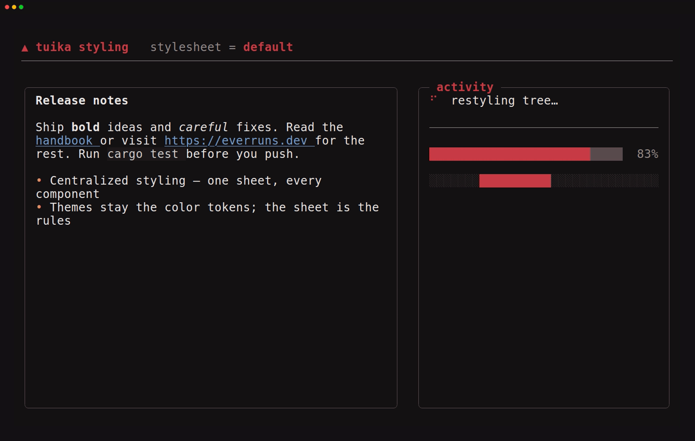
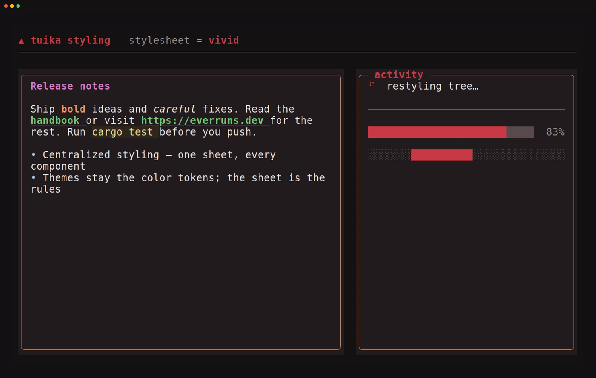
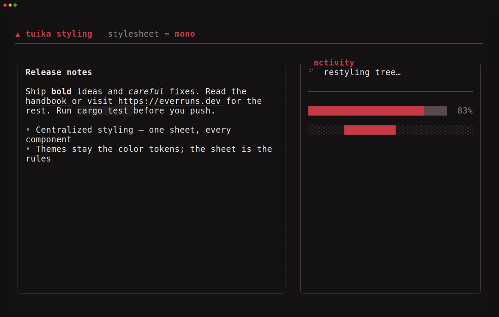

# tuika styling

tuika splits how a UI looks into two layers:

- a **`Theme`** — a flat set of named *colors* (`background`, `accent`, `border`,
  the markdown/code palette, …). Every component pulls from the theme; none
  hard-codes a color. This is the token layer, and it already existed — see
  [themes](../crates/tuika/docs/themes.md).
- a **`StyleSheet`** — a mapping from a semantic **role** (a heading, a link, an
  inline-code span, a list bullet, a panel's border and fill, …) onto a
  **`StyleBundle`**: the color and text attributes that role draws with. This is
  the rule layer, and it is what lets you restyle *by meaning*, in one place,
  without touching component code.

Swapping the sheet handed to a render restyles every element that role touches at
once — here the same markdown block and panels, painted under three different
stylesheets:


## Theme vs. stylesheet

Think CSS: the `Theme` is your custom properties (`--accent`, `--border`), and the
`StyleSheet` is the rules that map elements to them. The default sheet for a theme
reproduces exactly what components looked like before stylesheets existed, so
adopting it changes nothing until you override a role:

```rust
use tuika::{StyleSheet, Theme};

let theme = Theme::default();
let sheet = StyleSheet::from_theme(&theme); // a no-op: today's look, as data
```

Override a role with struct-update syntax — everything you don't name keeps
tracking the theme:

```rust
use tuika::{StyleBundle, StyleSheet, Theme};
use ratatui::style::Color;

let theme = Theme::default();
let sheet = StyleSheet {
    // green, bold links (and bare URLs) instead of the default
    link: StyleBundle::new().fg(Color::Green).bold().underlined(),
    // a magenta heading
    heading: StyleBundle::new().fg(Color::Rgb(210, 120, 200)).bold(),
    ..StyleSheet::from_theme(&theme)
};
```

A `StyleBundle` is *partial*: it overlays only the attributes it sets. A
color-less bundle (like the default emphasis rule, which just adds italic) keeps
the surrounding text's color and only contributes its modifier.

## Installing a stylesheet

A host sets one policy for the whole tree. Either paint with it directly:

```rust
use tuika::{paint_with_sheet, StyleSheet, Theme};

let theme = Theme::default();
let sheet = StyleSheet::from_theme(&theme);
// paint_with_sheet(buffer, area, &theme, sheet, root, &[]);
```

or, if you build your own `RenderCtx`, install it there with `.with_sheet(sheet)`.
Plain `paint` and `RenderCtx::new(theme)` keep using the theme's default sheet, so
nothing else has to change.

## Styling markdown — headings, links, and URLs

Markdown is fully role-driven. Every part below resolves its style from the sheet,
so one rule restyles it everywhere it appears — a bracketed `[link](url)` and a
bare `https://…` URL share the **same** `link` role, so restyling links restyles
both:

| Markdown part | Role |
| --- | --- |
| `# Heading` | `heading` |
| `[text](url)` and bare `https://…` | `link` |
| `` `inline code` `` | `inline_code` |
| `*emphasis*` | `emphasis` |
| `**strong**` | `strong` |
| `~~strikethrough~~` | `strikethrough` |
| `- ` / `1. ` bullets | `list_marker` |
| `- [ ]` task boxes | `task_marker` |
| `---` rules | `rule` |
| `` placeholder marker | `image_marker` |

The one-shot and streaming renderers both take the sheet:

```rust
use tuika::{markdown_to_lines, CodeHighlighter, StyleBundle, StyleSheet, Theme};
use ratatui::style::Color;

let theme = Theme::default();
let sheet = StyleSheet {
    link: StyleBundle::new().fg(Color::Green).bold(),
    ..StyleSheet::from_theme(&theme)
};
let lines = markdown_to_lines(
    "See the [docs](https://tuika.dev) or https://everruns.dev",
    60,
    &theme,
    &sheet,
    CodeHighlighter::Plain,
);
// both "docs" and the bare URL now render green + bold
```

`MarkdownState` (the streaming renderer) caches per `(theme, sheet)` and rebuilds
when either changes, so live restyling is safe.

## Styling panels

`Boxed` resolves the `panel` role. Its default sets nothing, so a plain box keeps
its theme border and no fill; set `panel.bg` to give **every** panel a shared
surface fill, and `panel.fg` to recolor unfocused borders — without a per-call
`.background(..)`:

```rust
use tuika::{StyleBundle, StyleSheet, Theme};

let theme = Theme::default();
let sheet = StyleSheet {
    panel: StyleBundle::new().fg(theme.accent_alt).bg(theme.surface),
    ..StyleSheet::from_theme(&theme)
};
```

Only **paint-time** attributes are stylesheet-owned. A component's `measure`
runs without a render context, so choices that change a component's footprint —
whether a border exists, how much padding — stay instance-level (e.g.
`Boxed::border`, `Boxed::padding`); the sheet owns color, background, and text
modifiers.

## Side by side

The three sheets above, held still:

| default | vivid | mono |
| --- | --- | --- |
|  |  |  |

Each is the [`examples/styling.rs`](../crates/tuika/examples/styling.rs) scene under
a different `StyleSheet`; see its `variants()` for the exact rules.

## Regenerating the demos

The GIFs are recorded from the styling example with
[VHS](https://github.com/charmbracelet/vhs) (needs `ttyd` and `ffmpeg` on `PATH`):

```bash
crates/tuika/scripts/gen-tuika-styling-demos.sh          # all variants
crates/tuika/scripts/gen-tuika-styling-demos.sh vivid    # just one
```

To preview a variant live in your own terminal:

```bash
cargo run -p tuika --example styling -- run          # cycle the sheets
cargo run -p tuika --example styling -- run vivid    # hold one
```
