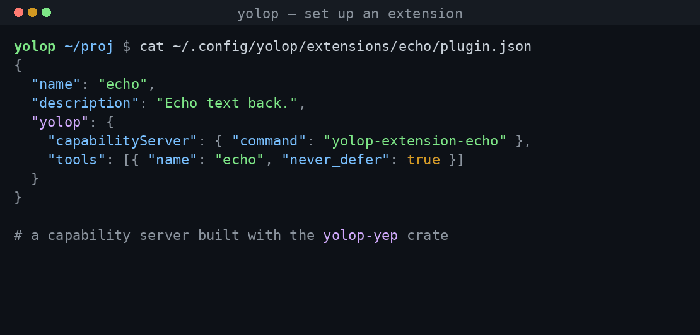

# Extensions

Extensions add capabilities to yolop — tools, system-prompt guidance, MCP
servers, and lifecycle hooks — as **installable packages**, with no rebuild of
yolop itself. An extension's logic runs as a small subprocess yolop talks to
over the yolop extension protocol (YEP); you can write one in any language, and
there's a Rust SDK ([`yolop-yep`](../crates/yolop-yep)) that makes it a few
lines.

This page covers **setting up** an existing extension and **creating** your
own. For the protocol and design rationale, see
[`specs/extensions.md`](../specs/extensions.md).



## What an extension can contribute

| Facet | What it adds |
|-------|--------------|
| **tools** | new tools the agent can call (streaming, stateful) |
| **prompt** / **dynamic_prompt** | system-prompt guidance (static, or recomputed per turn) |
| **mcpServers** | MCP servers yolop consumes through its own client |
| **hooks** | `pre_tool_use` / `post_tool_use` handlers (a pre-hook can block a call) |
| **config_schema** | validated, user-editable settings |

## Set up an extension

An extension is a directory containing a `plugin.json` manifest (and, for a
compiled server, its binary). Extensions live in **one place** — your global
config dir — so a repository never carries agent-specific machinery:

- Linux: `~/.config/yolop/extensions/<name>/`
- macOS: `~/Library/Application Support/yolop/extensions/<name>/`
- Override for testing: `YOLOP_EXTENSIONS_DIR`

**1. Install** — the fastest way is from **crates.io**, toolchain-free (no
cargo or rustc needed — yolop fetches and unpacks the `.crate` itself):

```
install_extension source="crates.io:yolop-extension-lsp"     # or a bare "lsp"
install_extension source="crates.io:yolop-extension-lsp@0.2.0"  # pin a version
```

You can also install from a **git URL** (`https://…[@rev]`) or a **local
path**, or just drop the package directory in place by hand. yolop has
`install_extension` / `list_extensions` / `enable_extension` /
`doctor_extension` tools, so "install and enable `yolop-extension-lsp`" works
conversationally. Installs are pinned in `extensions.lock` (source + resolved
version + content hash) so a later reinstall can flag a changed grant.

**2. Enable** — installing does not activate. Turn an extension on by adding it
to your harness in `~/.config/yolop/settings.toml`:

```toml
[[capabilities]]
ref = "ext:<name>"
```

(or run `enable_extension`). Changes take effect on the next session.

**3. Use** — start yolop; the extension's tools and prompt are available. To
watch it connect:

```bash
RUST_LOG=yolop::ext=debug yolop -p "list your tools"
# DEBUG yolop::ext: discovered extension `echo` (0.1.0)
# DEBUG yolop::ext: extension server connected ext=echo capabilities=["tools", "prompt"]
```

Installing runs third-party code on your machine — the same trust as adding a
server to `.mcp.json`. Install only from sources you trust; yolop prints what a
package contributes (server command, tool names, hooks) before you confirm.

## Create your own (Rust, with `yolop-yep`)

**1. A capability server.** Add the SDK and write handlers — the `serve()` loop
owns the wire protocol:

```bash
cargo new --bin yolop-extension-hello && cd yolop-extension-hello
cargo add yolop-yep serde_json
```

```rust
// src/main.rs
use serde_json::json;
use yolop_yep::{Server, ToolResponse};

fn main() -> std::io::Result<()> {
    Server::new("hello")
        .instructions("Use the greet tool to greet someone by name.")
        .tool("greet", |args| {
            let who = args.get("who").and_then(|v| v.as_str()).unwrap_or("world");
            ToolResponse::ok(json!({ "greeting": format!("hello, {who}") }))
        })
        .serve()
}
```

`Server` also takes `.on_hook(...)` (block/observe tool calls) and
`.dynamic_prompt(...)` (fresh prompt each turn). See
[`crates/yolop-yep/examples/echo.rs`](../crates/yolop-yep/examples/echo.rs) for
all three.

**2. A manifest** — `plugin.json` beside the built binary. The manifest is what
you (and other users) approve *without running the binary*, so it declares the
full tool definitions:

```json
{
  "name": "hello",
  "description": "Greets someone by name.",
  "version": "0.1.0",
  "yolop": {
    "protocol_version": "1.0",
    "capabilityServer": { "command": "yolop-extension-hello" },
    "tools": [
      {
        "name": "greet",
        "description": "Greet someone by name.",
        "schema": { "type": "object",
                    "properties": { "who": { "type": "string" } } },
        "never_defer": true
      }
    ],
    "prompt": true
  }
}
```

**3. Install it** — build, drop the binary and `plugin.json` into
`~/.config/yolop/extensions/hello/` (ensure the binary is on `PATH` or in the
package's `bin/`), and enable `ext:hello` as above.

### Manifest reference

Everything under the `yolop` key:

| Key | Meaning |
|-----|---------|
| `protocol_version` | YEP version you target (`"1.0"`). Major must match yolop's. |
| `capabilityServer` | `{ command, args }` — how to spawn your server. |
| `tools[]` | `{ name, description, schema, never_defer }`. `never_defer` keeps a tool's schema always loaded (budget: 8/extension). |
| `prompt` | `true` if the server sends a static system-prompt contribution. |
| `dynamic_prompt` | `true` to recompute the prompt each turn (`prompt/contribution`). |
| `mcpServers` | name → `{ type: stdio\|http, command/args/env or url/headers }` you provide. |
| `hooks[]` | `{ event: pre_tool_use\|post_tool_use, tool_name_glob, timeout_ms, on_error: warn\|block }`. |
| `config_schema` | JSON Schema for this extension's `[[capabilities]]` config. |

The running server's handshake may only **narrow** what the manifest declares,
never widen it — so the manifest is the complete, auditable statement of what an
extension can do.

### Naming & distribution

Name a crate `yolop-extension-<name>` so it's discoverable on crates.io under a
common prefix — and so the bare-name install shorthand (`install_extension
source="lsp"` → `yolop-extension-lsp`) resolves it.

**Publishing to crates.io.** Include `plugin.json` in the published package so
yolop can read it straight from the `.crate` tarball — no build step:

```toml
# Cargo.toml
include = ["src/**", "plugin.json", "README.md"]
```

`cargo publish`, and users install with `install_extension
source="crates.io:yolop-extension-<name>"`. yolop resolves the version through
the crates.io **sparse index**, downloads the tarball from the CDN, verifies
its SHA-256 against the index, and unpacks it — all without cargo or rustc.
Because a published crate ships source, the manifest's
`capabilityServer.command` should name a binary the user already has on `PATH`
(or one shipped in the package's `bin/`); yolop does **not** compile the crate.

The protocol vocabulary is published as a language-neutral index at
[`schema/yep/v1/meta.json`](../schema/yep/v1/meta.json) for authors writing
servers in other languages — YEP is just newline-delimited JSON-RPC over stdio,
so any language works (see [`specs/extensions.md`](../specs/extensions.md)).

> **Status.** The mechanism is implemented through hooks, the `yolop-yep`
> SDK ([published on crates.io](https://crates.io/crates/yolop-yep)), a
> `doctor_extension` conformance check, and toolchain-free **crates.io
> installs** (`install_extension source="crates.io:yolop-extension-<name>"`).
> Not yet shipped: a payload JSON Schema for the RPC types — see the spec's
> follow-ups.
