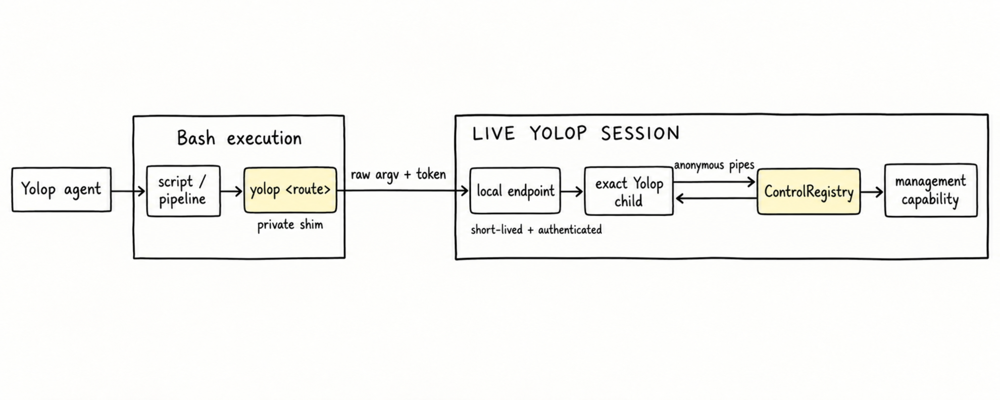
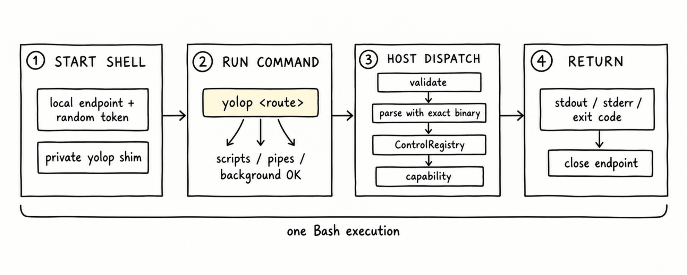

# Conversation Control Plane

Configuration and management do not need one model tool per operation. Yolop
instead advertises its registered CLI routes in one prompt block. The model
uses Bash to run `yolop <route>`, and that process calls back into the live
session.

## Parts

| Part | Job |
| --- | --- |
| Route summary | Tells the model which top-level `yolop` routes exist. |
| Shell attachment | Creates one endpoint, random token, and private executable shim per Bash execution. |
| Private shim | Makes `yolop` resolve to the exact executable running the host. |
| Local endpoint | Carries raw arguments from any shell descendant back to the session. |
| CLI child | Parses those arguments with the host's current command grammar. |
| `ControlRegistry` | Dispatches the typed request to the capability that owns it. |

## One call

1. Before Bash starts, the host creates the attachment. On Unix this is a Unix
   socket in a mode-`0700` temporary directory. Windows uses authenticated
   loopback TCP. The endpoint address, random token, and registered route names
   enter the shell environment, and the shim directory is prepended to `PATH`.
2. A shell descendant runs `yolop <route>`. The shim sends the raw argument
   vector, token, protocol version, and child product version to the endpoint.
   Scripts, pipelines, redirection, substitutions, and background expressions
   retain the attachment.
3. The host validates the token and protocol. It then starts its exact
   executable with a cleared environment. That child parses the canonical CLI
   grammar and exchanges a typed `ControlRequest` with the host over anonymous
   stdin and stdout pipes.
4. The registry calls the owning capability. The host returns stdout, stderr,
   and the exit code through the endpoint. When the Bash execution ends, the
   endpoint, token, shim, and temporary directory are removed.

## Boundaries

| Condition | Result |
| --- | --- |
| Read-only operation | Executes through the host broker. |
| Mutation under a shell sandbox | Crosses the sandbox only after the configured approval gate accepts it. |
| `approval_policy = "never"` | Rejects a mutating attached request that would cross the sandbox. |
| Bad token or incompatible protocol | Fails closed. |
| Stale or unreachable endpoint | Refuses to fall back to detached global mutation. |
| Help or invalid CLI arguments | Uses the exact host binary's parser and returns normal CLI output. |

The endpoint is local and short-lived, but it is intentionally inherited by the
shell process tree. Provider credentials remain in the parent process and are
not passed to the CLI child.

## Scope

The control plane covers administration such as setup, model selection,
configuration, hooks, skills, extensions, connectors, MCP servers, profiles,
and session coordination. File access, search, Bash, and background execution
remain structured model tools.
