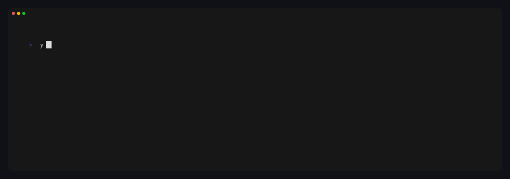

# Full-screen mode

`yolop --fullscreen` runs the interactive TUI on the terminal's **alternate
screen** — the whole window becomes the session — instead of the default inline
composer that lives at the bottom of your normal scrollback. It is powered by
the [`tuika`](https://crates.io/crates/tuika) terminal-UI toolkit and is
currently **experimental**.



## When to use it

Reach for full-screen mode when you want a dedicated, app-like surface for a
long session: the transcript, the message separator, the composer, and the
status bar all stay pinned in place, and overlays (setup, model picker,
approvals) take over the whole viewport rather than opening inline. The default
inline renderer is still the better fit when you want yolop to share the screen
with the rest of your shell scrollback.

## Defaults and platforms

- Off by default — pass `--fullscreen` to opt in. Everything else (provider,
  model, tools, slash commands, sessions) behaves exactly as in the inline
  renderer.
- Works on the same terminals as the inline TUI on macOS and Linux. A terminal
  that supports the alternate screen is required (essentially all modern
  emulators).

## Usage

```bash
yolop --fullscreen                              # full-screen TUI, default provider
yolop --fullscreen --provider llmsim            # offline demo, no API key required
yolop --fullscreen -C /path/to/repo             # a different workspace
```

Exit the session with `Ctrl-C` twice (or `Ctrl-D`); the alternate screen is
restored on the way out, so your shell scrollback is left untouched.

## Expected behavior

- The renderer owns scrolling and overlays in-app: use the keyboard/mouse to
  scroll the transcript, and the `[expand ↓]` control to grow the composer.
- Slash commands, the `!` shell escape, image paste, and soft approval all work
  the same as in the inline renderer.

## Limitations

- Because the session takes over the alternate screen, **native terminal
  scrollback is unavailable** while yolop is running — scroll within the app
  instead. Everything the session printed is gone from the terminal once you
  exit, by design; use `--trajectory-out` if you need a durable record.
- The mode is experimental; its presentation may change between releases.

## Regenerating the recording

The GIF above is a reproducible [VHS](https://github.com/charmbracelet/vhs)
capture that drives the real binary against the offline `llmsim` provider. From
the repository root, with a debug build present:

```bash
cargo build
vhs docs/features/fullscreen/fullscreen.tape
```
