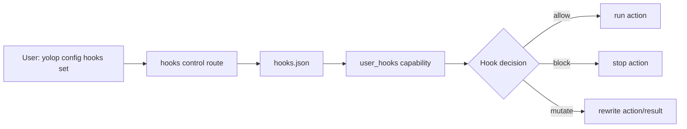

Hooks let you attach deterministic automation to Yolop's agent loop. They are
useful when an instruction is too important to leave as a preference: block a
class of shell commands, rewrite unsafe tool arguments, or record an audit event
outside the model.

Yolop uses the upstream `everruns-core` `user_hooks` capability. The local
Yolop layer only discovers hook files, merges workspace and global scopes, and
exposes `yolop config hooks` plus a host control route for those files.

## How it works


```mermaid
flowchart LR
  User["User: yolop config hooks set"] --> Hooks["hooks control route"]
  Hooks --> Files["hooks.json"]
  Files --> Runtime["user_hooks capability"]
  Runtime --> Decision{"Hook decision"}
  Decision -->|allow| Continue["run action"]
  Decision -->|block| Stop["stop action"]
  Decision -->|mutate| Rewrite["rewrite action/result"]
```

The attached CLI validates and writes hook configuration atomically. Hook
management is not exposed as model tools.

## Scopes

| Scope | Path | Use for |
|---|---|---|
| Global | `<config_dir>/yolop/hooks.json` | Personal Yolop behavior across all workspaces |
| Workspace | `<workspace>/.agents/hooks.json` | Project-owned policy that can be reviewed with the repo |

Workspace hooks override global hooks with the same `id`. A workspace file can
also disable a lower-precedence global hook by listing the id in `disabled`.

## Configure with the CLI

```bash
yolop config hooks list
yolop config hooks set hook.json --scope workspace
```

Use `get` to inspect one effective hook and `remove` to delete or disable a hook
in a selected scope.

## Configure by file

```json
{
  "hooks": [
    {
      "id": "block-git",
      "event": "pre_tool_use",
      "matcher": {
        "tool_name": "bash",
        "args_jsonpath": "$.command",
        "match_regex": "(^|[;&|()[:space:]])git([[:space:]]|$)"
      },
      "executor": {
        "type": "bash",
        "command": "printf '%s\\n' '{\"decision\":\"block\",\"reason\":\"git command blocked by hook\",\"user_message\":\"Blocked by your Yolop hook: git commands are disabled.\"}'"
      },
      "timeout_ms": 1000,
      "on_error": "block",
      "description": "Block bash commands that invoke git"
    }
  ],
  "disabled": [],
  "disabled_contributions": []
}
```

## Events

Yolop accepts the upstream `user_hooks` event names. Tool-call hooks are the
primary v1 surface.

| Event | Can block? | Can mutate? | Typical use |
|---|---|---|---|
| `pre_tool_use` | yes | yes | Block or rewrite tool calls |
| `post_tool_use` | no | yes | Rewrite tool results |
| `user_prompt_submit` | yes | yes | Reject or rewrite inbound prompts |
| `turn_end` | no | no | Advisory reporting after a turn |
| `session_start` | no | no | Advisory setup or audit |
| `session_end` | no | no | Advisory cleanup |

Tool events can match on exact tool name, restricted tool glob, and simple
argument JSON paths. Regexes use Rust's `regex` crate.

## Hook decisions

A bash hook prints one JSON decision to stdout:

```json
{ "decision": "allow" }
```

```json
{
  "decision": "block",
  "reason": "git command blocked by hook",
  "user_message": "Blocked by your Yolop hook: git commands are disabled."
}
```

```json
{
  "decision": "mutate",
  "patch": { "arguments": { "command": "cargo fmt --check" } }
}
```

If stdout is empty, exit code `0` means allow and non-zero means block with
stderr as the reason. Non-JSON stdout is treated as a hook error.

## Trust model

Hooks are code execution. Global hooks are personal config. Workspace hooks are
project policy, similar to checked-in build scripts or `.mcp.json` stdio
servers. Review them before using an unfamiliar repository.

The hook executor is bounded by the upstream `user_hooks` implementation:
validated specs, timeout limits, output caps, and structured decisions. Yolop
does not add a second hook engine.

## Related

- [Approvals](./approvals.md)
- [Shell sandboxing](./sandboxing.md)
