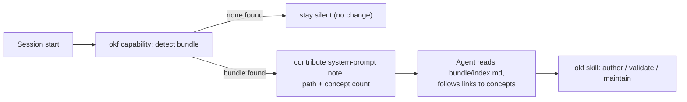

The [Open Knowledge Format](https://okf.md/spec/) (OKF, an open specification
from Google Cloud) represents a body of knowledge as a plain **directory of
markdown files with YAML frontmatter** — no database, SDK, or runtime. It is a
portable way to hand an agent the curated context it needs: architecture notes,
data models, metrics, processes, conventions. If you can `cat` a file, you can
read OKF.

Yolop supports OKF with two cooperating pieces: a bundled **`okf` skill** that
teaches reading, authoring, and validating bundles, and an always-on **`okf`
capability** that detects a bundle in your workspace and points the agent at it.
Neither requires configuration, and both are inert in repositories that have no
bundle.

## How it works



At session start the capability looks for a bundle. When it confidently finds
one it adds a short note to the system prompt naming the bundle path and how many
concept documents it holds, so the agent knows to consult the bundle **before**
exploring the repo file-by-file. When no bundle is present it contributes
nothing.

## What a bundle looks like

A bundle is just a directory tree of markdown. The unit of knowledge is a
**concept** — one markdown file — identified by its path minus `.md` (its
*concept-id*). Concepts link to each other with ordinary markdown links, turning
the directory into a graph.

```
.okf/
├── index.md            # directory listing (read first)
├── log.md              # dated changelog
├── modules/
│   └── auth.md         # a concept document
└── metrics/
    └── signups.md
```

Every concept file carries YAML frontmatter. Only `type` is required:

```markdown
---
type: Module
title: Auth
description: Session and credential handling for the API.
resource: file:///src/auth
tags: [security, api]
timestamp: 2026-07-20T10:30:00Z
---

# Auth

Handles login, tokens, and session lifecycle.

## Relationships
- Emits the [signups metric](/metrics/signups)
```

`index.md` and `log.md` are **reserved** files (both optional): `index.md` is a
listing for cheap orientation, `log.md` is a chronological changelog. A bundle
conforms to OKF v0.1 when every non-reserved `.md` file has parseable
frontmatter with a non-empty `type`; everything else is soft guidance.

## Detection

OKF defines **no canonical bundle marker** — no required root manifest and no
fixed directory name — so Yolop never assumes one is present. It resolves a
bundle in this order:

| Order | Source | Accepted when |
|---|---|---|
| 1 | `YOLOP_OKF_BUNDLE_DIR` (workspace-relative or absolute) | it resolves to a directory (trusted — you declared it) |
| 2 | Conventional roots `.okf/` then `okf/` | a content signature holds: an `index.md`, or a non-reserved `.md` whose frontmatter has a non-empty `type` |
| 3 | — | nothing detected; the capability stays silent |

The content signature is what keeps a plain markdown directory (a Jekyll site,
an Obsidian vault, `docs/`) from being mistaken for a bundle. Detection runs once
at session start and the candidate scan is bounded, so a mis-pointed directory
cannot stall startup. A bundle added mid-session is picked up on the next
session.

## Working with a bundle

The `okf` skill carries the full format model and drives these workflows. It is
compiled into the binary, so it works offline.

- **Consume** — read `<bundle>/index.md` first, then follow links into the
  concept documents relevant to the task instead of grepping blindly. The
  capability's note nudges the agent to do this automatically.
- **Author / convert** — create concept files (one idea per file, always a
  `type`), link them with `/`-absolute concept links, and keep `index.md` and
  `log.md` current. The skill also covers converting a Notion export, Obsidian
  vault, or CSV into OKF.
- **Validate** — the skill ships a zero-dependency checker for the three
  conformance rules, with `--strict` (require `title`/`description`/`timestamp`)
  and `--check-links` (report broken intra-bundle links) modes.
- **Produce / maintain** — because the skill teaches authoring, a repository can
  instruct Yolop (for example from `AGENTS.md`) to keep its bundle current after
  changes that alter durable facts; Yolop updates the affected concepts,
  `index.md`, and `log.md` through the skill. No separate feature is needed.

Ask in plain language:

```text
document this service as an OKF bundle
validate the .okf bundle
what does the knowledge base say about auth?
```

## Configuration

| Setting | Effect |
|---|---|
| `YOLOP_OKF_BUNDLE_DIR` | Point detection at a bundle in a non-conventional location (workspace-relative or absolute). Otherwise `.okf/` and `okf/` are auto-detected by content signature. |

There is nothing to enable: the capability is on by default and does nothing
until a bundle is present.

## Related

- [OKF specification](https://okf.md/spec/)
