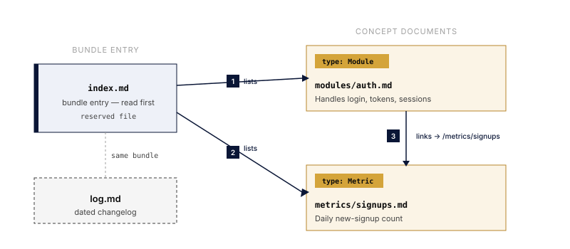

The [Open Knowledge Format](https://github.com/GoogleCloudPlatform/knowledge-catalog/blob/main/okf/SPEC.md)
(OKF, an open specification from Google Cloud) represents a body of knowledge as
a plain **directory of markdown files with YAML frontmatter**: no database,
SDK, or runtime. It is a portable way to keep the curated context an agent needs
, architecture notes, data models, metrics, processes, conventions, right in
the repo. If you can `cat` a file, you can read OKF.

Yolop ships a built-in **`okf` skill** that knows the format end to end: it
reads a bundle as high-signal context, authors new concepts, converts other
sources into OKF, and validates conformance. The skill is compiled into the
binary, so it works offline, and it tracks OKF v0.2.

## What a bundle looks like

A bundle is a directory tree of markdown. The unit of knowledge is a **concept**
, one markdown file, identified by its path minus `.md` (its *concept-id*).
Concepts link to each other with ordinary markdown links, so the directory is a
graph, not just a folder.



Every concept file carries YAML frontmatter, and only `type` is required:

```markdown
---
type: Module
title: Auth
description: Session and credential handling for the API.
resource: file:///src/auth
tags: [security, api]
status: stable
generated: { by: yolop/opus, at: 2026-07-20T10:30:00Z }
verified: { by: human:mchaliy, at: 2026-07-21T08:00:00Z }
---

# Auth

Handles login, tokens, and session lifecycle.

# Relationships

Emits the [signups metric](/metrics/signups.md).
```

`index.md` and `log.md` are **reserved** files (both optional): `index.md` is a
listing you read first for cheap orientation, `log.md` is a dated changelog. A
bundle conforms when every non-reserved `.md` file has parseable frontmatter
with a non-empty `type`, everything else is soft guidance.

## Provenance and trust

Because bundles are increasingly written by agents, OKF v0.2 makes "where did
this come from" and "how much should I trust it" answerable from frontmatter,
and the skill reads and writes all of it:

- **`sources`**: what a concept was derived from, with per-source signals
  (`author`, `usage_count`, `last_modified`) and footnotes keyed to a source `id`
  for per-claim attribution.
- **`generated` / `verified`**: who wrote it versus who confirmed it, using one
  actor convention (`agent/version`, `human:<id>`, `process:<id>`). A human
  verifier is what separates a reviewed fact from a machine-confirmed one.
- **`status` and `stale_after`**: `draft`/`stable`/`deprecated`, and the date a
  concept goes stale. Yolop weighs both before relying on a concept, and checks
  against the real system when a concept is deprecated or past its date.
- **Attested computations**: a `type: Attested Computation` concept carries a
  sanctioned computation plus the executor and attester that prove a value came
  from it. Yolop supplies parameter values only; it will not rewrite a sanctioned
  computation.

## Working with a bundle

Just ask Yolop in plain language; the skill supplies the how-to.

```text
document this service as an OKF bundle
validate the knowledge bundle
convert my Obsidian vault to OKF
what does the knowledge base say about auth?
```

- **Read**: Yolop reads `index.md` first, then follows links into the concepts
  relevant to the task instead of grepping blindly.
- **Author / convert**: one idea per file, always a `type`, linked with
  `/`-absolute concept links; `index.md` and `log.md` kept current. Covers
  converting a Notion export, Obsidian vault, or CSV into OKF.
- **Validate**: a zero-dependency checker enforces the three conformance rules,
  with `--strict` (also lint the recommended fields, `generated`, and the
  `runtime` an attested computation needs) and `--check-links` (report broken
  intra-bundle links) modes.

## How Yolop finds your bundle

OKF deliberately defines **no fixed directory name and no root marker**: a
bundle is any directory you decide holds one. Yolop does not guess: it does not
probe for a magic folder or invent a convention. If you keep a bundle in a repo
and want Yolop to reach for it on its own, point at it in `AGENTS.md`:

```markdown
Knowledge lives in the OKF bundle under `./knowledge` — consult it before
exploring the code, and keep it current when durable facts change.
```

Yolop re-reads `AGENTS.md` every turn, so that one line is enough for it to
read, and maintain, the bundle through the `okf` skill.

## Related

- [OKF specification (v0.2)](https://github.com/GoogleCloudPlatform/knowledge-catalog/blob/main/okf/SPEC.md)
- [knowledge-catalog repository](https://github.com/GoogleCloudPlatform/knowledge-catalog)
