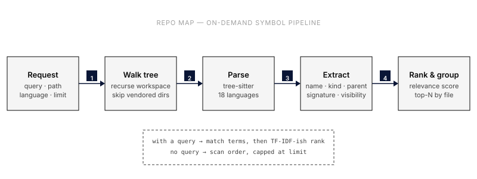

Repo Map gives Yolop a fast, structural overview of a codebase without reading
every file. Instead of streaming whole directories into the model, the
`repo_map` and `repo_symbols` tools parse source on demand and return a compact
list of symbols, functions, types, classes, and their signatures, that the
agent can use to orient itself before reaching for targeted `grep` and `read`.

## Background

Coding agents waste context when they explore an unfamiliar repository
file-by-file. A common fix is a "repository map": a precomputed digest of
signatures that is stuffed into the prompt up front. That approach fits
assistants that cannot navigate on their own, but it has real costs, the map
goes stale the moment code changes, and it is paid for on every turn whether or
not the current task needs it.

Yolop takes the opposite stance. It already has first-class navigation tools, so
the symbol map is generated **on demand** and **read-only**, scoped to exactly
the path and query the agent asks for. `grep`/`read` remain the hot path for
exact text and implementation detail; the map is structural context, not a
replacement for reading code.

## How it works

1. **Request**: the agent calls `repo_map` or `repo_symbols` with an optional
   `path`, `query`, `language`, and `limit`.
2. **Walk tree**: the workspace (or the requested subpath) is walked
   recursively, skipping vendored and build directories such as `.git`,
   `node_modules`, `target`, `dist`, `build`, and virtualenvs. The walk is
   sandboxed to the workspace: paths that escape via `..` or symlinks pointing
   outside the root are rejected.
3. **Parse**: each supported file is parsed with its
   [tree-sitter](https://tree-sitter.github.io/) grammar. Files larger than
   `max_file_bytes` are skipped, and partially-parseable files still contribute
   the symbols that did parse.
4. **Extract**: declarations are turned into symbols carrying their `name`,
   `kind`, enclosing `parent` scope, one-line `signature`, `visibility`, and
   source location.
5. **Rank & group**: when a query is present the candidates are scored and
   ordered by relevance; `repo_map` groups the result by file while
   `repo_symbols` returns a flat ranked list.

## Relevance ranking

Without a query, symbols are returned in scan order and capped at `limit`.

With a query, results are ranked with a lightweight, deterministic TF-IDF-ish
score, no embeddings, no index, no network:

- **Terms**: the query is lowercased and split on whitespace into
  de-duplicated terms. A symbol is a candidate if it matches *any* term, so
  `auth handler` matches symbols related to either word instead of requiring the
  exact phrase.
- **Field weights**: each term contributes the strongest field it matches, so
  specific hits beat incidental ones:

  | Match | Weight |
  |---|---|
  | Exact name | 12 |
  | Name substring | 6 |
  | Kind (e.g. `function`, `class`) | 4 |
  | Parent scope | 3 |
  | Signature | 2 |
  | Path | 1 |

- **Inverse document frequency**: terms that match fewer candidates are
  weighted higher, so a rare, distinctive term outranks a common one.
- **Coverage boost**: symbols that match more of a multi-term query are
  promoted above symbols that match only one term.
- **Deterministic order**: ties break by path, then line, then column, so the
  same query always returns the same order.

To keep ranking predictable on large trees, the candidate pool is bounded
(currently 5000 symbols) before scoring, and the final result is truncated to
`limit`. A `truncated` flag in the response signals when more matched than were
returned.

## The two tools

| Tool | Returns | Use when |
|---|---|---|
| `repo_map` | Symbols grouped by file | Broad orientation across an area of the codebase |
| `repo_symbols` | A flat, ranked symbol list | You want specific symbol candidates to act on |

Both accept the same parameters:

| Parameter | Default | Notes |
|---|---|---|
| `path` | workspace root | Workspace-relative file or directory to scan |
| `query` | _none_ | Space-separated terms; enables relevance ranking |
| `language` | all | Restrict to one language (e.g. `rust`, `python`, `cpp`) |
| `limit` | 200 | Maximum symbols returned (max 1000) |
| `max_file_bytes` | 524288 | Skip source files larger than this (max 2 MiB) |

Responses also report scan statistics, `scanned_files`, `skipped_files`,
`skipped_large_files`, `skipped_unsupported_files`, `parse_error_files`, the set
of `languages` seen, and the `count` of returned symbols.

## Supported languages

Yolop ships tree-sitter grammars for 18 languages. Extracted symbol kinds vary
by language but cover the headline declarations of each.

| Language | Extensions | Symbol kinds (highlights) |
|---|---|---|
| Rust | `.rs` | struct, enum, trait, impl, function, type, const, macro, module |
| Python | `.py`, `.pyi` | class, function |
| TypeScript | `.ts`, `.mts`, `.cts` | class, interface, enum, type, function, method |
| TSX | `.tsx` | class, interface, enum, type, function, method |
| JavaScript | `.js`, `.jsx`, `.mjs`, `.cjs` | class, function, method |
| C# | `.cs` | class, interface, struct, record, enum, method, property |
| Go | `.go` | function, method, type |
| Zig | `.zig`, `.zon` | struct, enum, function, variable |
| Java | `.java` | class, interface, enum, record, method, constructor |
| C | `.c`, `.h` | struct, union, enum, function |
| C++ | `.cpp`, `.cc`, `.cxx`, `.hpp`, `.hh`, `.hxx` | class, struct, union, enum, namespace, function |
| PHP | `.php` | class, interface, trait, enum, function, method, namespace |
| Ruby | `.rb` | class, module, method |
| Kotlin | `.kt`, `.kts` | class, object, function, property |
| Scala | `.scala`, `.sc` | class, object, trait, function, type, val |
| CSS | `.css` | selector, keyframes, import |
| HTML | `.html`, `.htm` | element, script |
| Bash | `.sh`, `.bash`, `.zsh` | function |
| SQL | `.sql` | table, view, function, index, trigger, type, schema, sequence |

Unsupported files are counted and skipped rather than failing the scan.

## Safety and limits

- **Read-only.** The tools never modify the workspace.
- **Sandboxed.** Scans cannot escape the workspace root.
- **Bounded.** Per-file size limits, a candidate cap, and the `limit` parameter
  keep responses compact and fast; `truncated` reports when output was clipped.

## Related

- Diagram source: [`repo-map.mmd`](repo-map.mmd)
