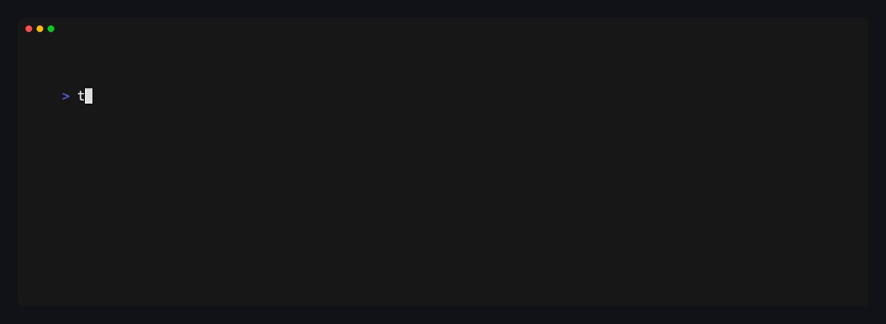

# Shell sandboxing

Yolop can run shell commands inside native operating-system containment. The
sandbox limits the damage an incorrect or compromised model can cause after a
command has been selected for execution, but it is opt-in.

Sandbox mode and [approval policy](../approvals.md) form a matrix. The sandbox
sets the technical boundary; hard approval controls when Yolop may ask to cross
it. Soft approval remains a separate judgement layer for critical actions.



## What is contained

The same policy covers every Yolop shell entry point:

- the model-facing `bash` tool;
- background shell jobs;
- the `/shell` command; and
- the TUI `!shell` shortcut.

The modes are:

| Mode | Shell access |
|---|---|
| `read-only` | Host reads and temporary writes; workspace writes and network denied. |
| `workspace-write` | Host reads plus writes in the active workspace and temporary directories; network denied. |
| `danger-full-access` | Unrestricted host execution. This is the default, and Yolop marks this `UNSAFE HOST`. |

With `workspace-write` mode:

- the active workspace, `/tmp`, and a private temporary directory are writable;
- writes outside those locations are denied;
- internet and packet-network sockets are denied;
- restrictions are inherited by child processes; and
- provider credentials and local agent socket paths are removed from the shell
  environment.

In `workspace-write`, `/tmp` is shared with other host processes. This matches
common development tool expectations, but it is not a private security
boundary: commands can create, replace, and communicate through files there.
Yolop still points `$TMPDIR` and `$HOME` at its private per-process directory
for tools that honor those variables.

Host files remain readable so compilers, SDKs, package caches, and installed
skills continue to work. Structured file tools use Yolop's separate rooted
workspace checks rather than the shell sandbox.

`AGENTS.md` and system, global, workspace, or extension skills can guide which
tools the model calls, but they cannot replace the shell executor. Commands
requested through those instructions still cross the same native boundary.

When a failing shell command contains an operating-system denial such as
`Operation not permitted` or `Permission denied`, Yolop marks stderr with a red
dot and reports that the native sandbox likely blocked the operation. The word
“likely” is intentional: Linux uses the same error text for sandbox policy and
ordinary file permissions.

## What is not contained by this boundary

The native policy is specifically the boundary for arbitrary shell commands,
not every trusted process Yolop starts:

- structured file tools use a rooted workspace broker;
- Git worktree and checkpoint management runs in Yolop's trusted control plane;
- hooks use Bashkit's virtual interpreter and filesystem rather than a host
  shell; and
- opt-in LSP servers and user-configured MCP or extension servers are
  control-plane processes and are not automatically moved into the native
  shell sandbox.

Treat configured local servers and language servers as trusted software. Any
shell command they cause the model to request is still sandboxed, but their own
process permissions are outside this policy.

## Platform support

| Platform | Enforcement | Requirements |
|---|---|---|
| macOS | Seatbelt | `/usr/bin/sandbox-exec`, included with supported macOS versions |
| Linux | Landlock filesystem rules and seccomp-BPF network filtering | Full Landlock ABI v3 support: Linux 6.2 or a vendor backport |
| Windows | No native containment yet; every mode warns and runs unsandboxed | Run Yolop inside trusted containment |
| Other platforms | Sandboxed modes fail closed | Run Yolop inside trusted containment before choosing full access |

If the required operating-system primitive is unavailable, Yolop returns a
sandbox setup error. It never silently retries the command on the host.

## Worktrees and Git

Yolop resolves the active workspace immediately before each command. Switching
to another managed worktree changes the writable boundary for the next command
without restarting the session.

On macOS, `.git` below the active workspace is read-only to arbitrary shell
commands. On Linux, Landlock cannot subtract an in-workspace `.git` directory
from the writable workspace grant, so that metadata is writable. Metadata for
a linked worktree that lives outside the active workspace remains protected.
The active worktree is writable wherever it is stored. When worktrees live
below shared `/tmp`, that broader writable root also covers sibling temporary
worktrees; do not treat `/tmp` as session isolation.

## Modes × approvals

The default policy is `danger-full-access × on-request`. `untrusted` asks
before commands outside a conservative read-only allowlist. `on-failure` tries
inside the sandbox, then asks before a full-access retry after a likely sandbox
denial. `on-request` asks only when the agent explicitly requests escalation.
`never` refuses escalation without prompting.

Shell approvals are available in the interactive TUI. Print and ACP shell
escalation requests fail closed; ACP's separate general tool-permission gate
still works with compatible editor clients. Direct, model-facing, and
background shell calls use the same policy.

```toml
sandbox_mode = "workspace-write" # opt into containment
approval_policy = "on-request"   # implicit default
```

## Enabling the sandbox

Enable native containment for one invocation with:

```bash
yolop --sandbox
```

To persist containment, add `sandbox_mode = "workspace-write"` to Yolop's
`settings.toml`, or ask Yolop to set the `sandbox_mode` configuration key. The
change applies on the next run. Clearing the key restores the default.

> **Danger:** The default `danger-full-access` mode gives shell commands
> unrestricted access to host files, processes, credentials present in the
> environment, and the network. A jailbroken or confused model can damage the
> host.

Yolop marks this state as `UNSAFE HOST` in configuration output, startup
warnings, the TUI transcript, and the status bar.

## Troubleshooting

### Native sandbox unavailable on Linux

Check the kernel version and whether the distribution enables Landlock. Yolop
requires full ABI v3 enforcement because earlier versions do not mediate every
filesystem operation needed by the write boundary.

### A build cannot download dependencies

Sandboxed modes intentionally deny network access. With `on-request`, the agent
can request a justified full-access retry. Otherwise populate dependency caches
before starting Yolop, use structured integrations outside the shell boundary,
or run Yolop inside separate trusted containment before choosing full access.

### A command cannot write a file

In `workspace-write`, confirm the target is below the currently active
workspace or `/tmp`. In `read-only`, workspace writes are intentionally denied.
Absolute paths, symlink targets, and linked-worktree metadata outside those
writable roots remain read-only.

## Current limitations

- Host reads are allowed for toolchain compatibility.
- Shared `/tmp` is writable in `workspace-write` and can be used to communicate
  with other host processes.
- Worktrees stored below shared `/tmp` do not have write isolation from other
  sandboxed commands that can address their paths.
- The trusted-command classifier for `untrusted` is intentionally conservative;
  unfamiliar commands prompt even when harmless.
- There is no per-command mount policy or network allowlist.
- Linux permits `.git` writes when the metadata is physically inside the
  writable workspace.
- Trusted control-plane processes listed above are outside the shell boundary.
- Wall-clock and output limits apply, but native mode does not yet provide
  cgroup or VM resource quotas.
