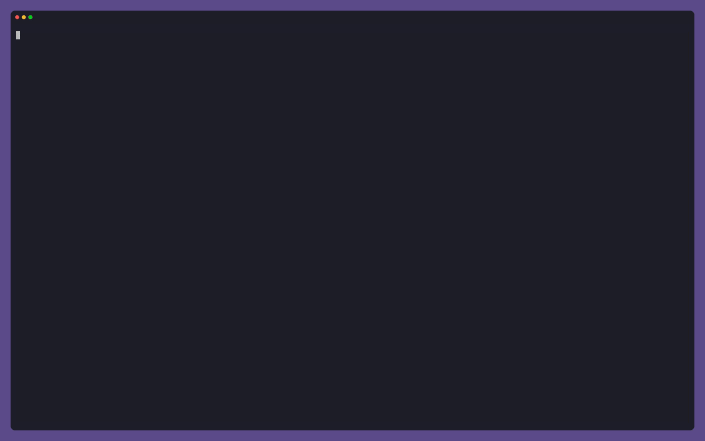

# Registry skills and Mermaid diagrams

Yolop installs skills from the public [skills.sh](https://skills.sh) registry
during a session, and paints ` ```mermaid ` fences as terminal diagrams instead
of echoing their source. Together those two things let you teach a running
session a new way to answer and see the result immediately.

The recording installs [`humanlayer/skills/show-me`][show-me] — a skill that
answers visually rather than in prose — and then asks it to explain how a
repository deletion request flows through an unfamiliar service.



## Installing a skill mid-session

Ask for a skill by name or by the job you want done. Yolop searches the
registry with `search_skills`, then `install_skill` writes the snapshot into a
scope:

- `workspace` (the default) → `.agents/skills/<name>/`
- `global` → `~/.agents/skills/<name>/`

The skill is live on the next turn — no restart — so the same session that
installed it can use it. `delete_skill` uninstalls; bundled system skills are
read-only. For skills that are not on skills.sh, fetch the files and use
`write_skill` instead.

## Mermaid rendering

A ` ```mermaid ` fence in an assistant message is rendered by
[`tuika-mermaid`](https://crates.io/crates/tuika-mermaid) as Unicode
box-drawing cells. Diagrams that fail to parse — or that are wider than the
transcript — keep the ordinary highlighted code block, so the source stays
readable rather than being painted clipped.

That width guard is worth knowing when you ask for a diagram: a sequence
diagram with long participant aliases and full argument lists in every message
can need well over 200 columns, and will fall back to source in a normal
terminal. Asking for short participant names and short message labels keeps it
in diagram form.

## Reproducing the demo

The capture needs `vhs`, `ttyd`, and `ffmpeg` on `PATH` plus an authenticated
Anthropic provider. From the repository root:

```console
cargo build
vhs validate docs/features/show-me/demo.tape
vhs docs/features/show-me/demo.tape
```

`demo-setup.sh` writes the disposable `orbit-registry` fixture under
`/tmp/yolop-show-me-orbit`; nothing in it is compiled, so the capture spends its
time on the agent rather than on rustc. The tape installs the skill from the
live registry, so it needs network access.

[show-me]: https://skills.sh/humanlayer/skills/show-me
