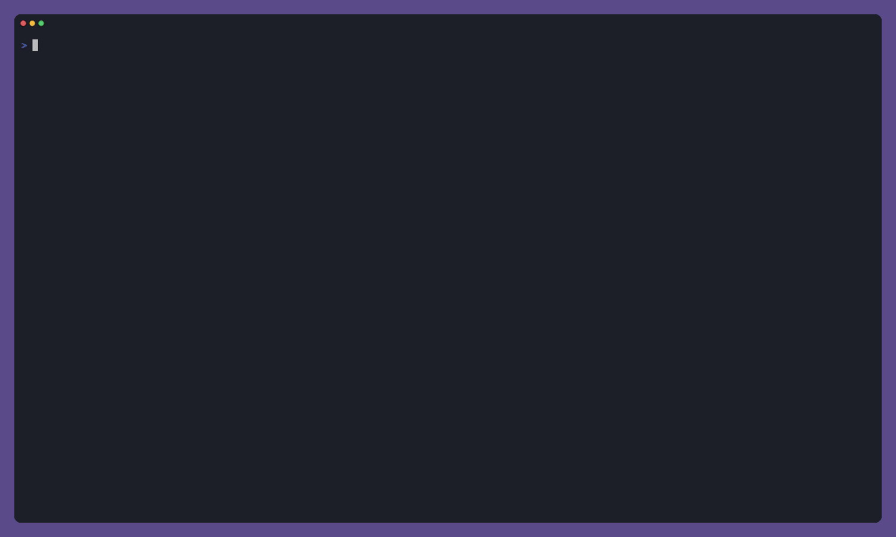

# Parallel sub-agents

Yolop can delegate independent work to background sub-agents. Each sub-agent
gets its own context window and shares the parent session's workspace. Use the
agent sidebar to watch the hierarchy and live status of every delegated agent.
It opens automatically when the first sub-agent starts without taking focus
from the composer. Use `Ctrl+B` to focus, close, or reopen it, inspect completed
summaries, and cancel a selected branch.



The recording uses four lead agents with four issue agents each. Together with
the leads, that is 20 sub-agents working as a two-level tree. This topology stays
inside the five-active-background-tasks limit for any one session while making
20-way delegation possible.

Sub-agents are best for work that can be split by ownership: independent issue
files, test failures, audits, migrations, or research questions. Concurrent
agents share one working tree, so give each branch non-overlapping files and
reserve shared manifests, lockfiles, and final integration for the coordinator.

The default hierarchy allows two child levels and up to 32 active descendants.
You can tighten those limits in `settings.toml`:

```toml
[[capabilities]]
ref = "subagents"
max_subagent_depth = 2
max_active_descendant_tasks = 12
max_total_descendant_tasks = 100
```

Background agents consume provider requests and tokens concurrently. Start with
a small fan-out, use explicit task boundaries, and keep the root responsible for
the final full test run.

To reproduce the demo from the repository root, authenticate the Codex provider
and run:

```console
cargo build
vhs validate docs/features/subagents/demo.tape
vhs docs/features/subagents/demo.tape
```
