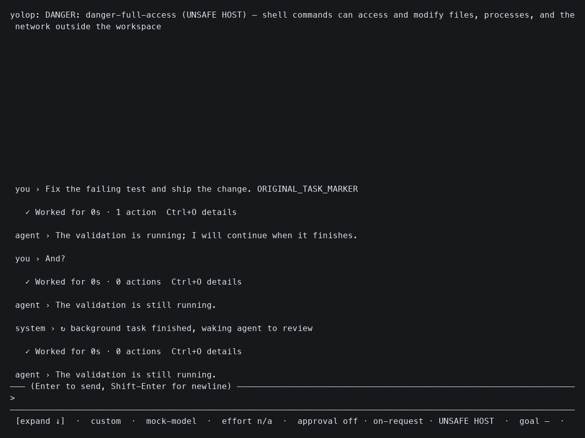
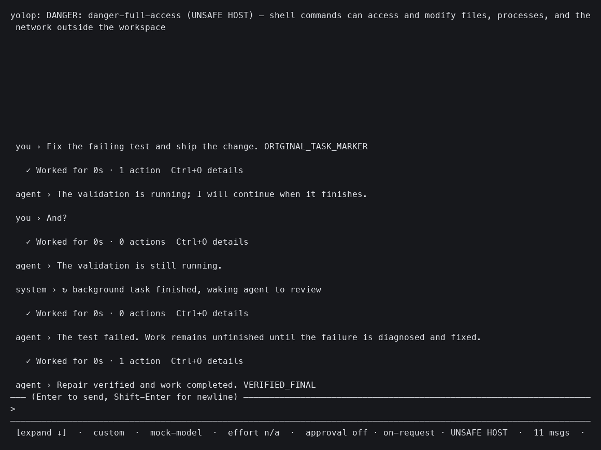

# Task completion evidence

The October 8, 2026 regression capture runs the installed 0.18.4 binary and this
change through a real 112 by 36 PTY with a deterministic local OpenAI-compatible
provider. The images render the captured terminal grid, rather than a desktop
window. Both runs receive `Fix the failing test and ship the change`, followed
by `And?`, while a background shell prints a validation failure and exits 1.

| Observation | Before, 0.18.4 | After, this change |
| --- | --- | --- |
| Original request survives the background wake | No | Yes |
| Automatic repair executes | No | Yes |
| Repair marker verified on disk | No | Yes |
| Final visible response | Validation still running | Repair verified and work completed |

Permanent automated coverage lives in the ACP failing-command and idle-promise
scenarios, the print background recovery scenario, and the TUI review cancellation
and host-command scenarios in the root test suite. These use real host entry
points and captured provider requests, not a judge-only assertion.

A separate live GPT-5.5 prompt A/B used three trials per variant on a failing
Python function with positive and negative assertions. Both the unchanged prompt
and an added autonomy paragraph passed 3/3 with the assertions preserved and no
automatic repairs. This small probe shows no uplift from the paragraph, so the
base autonomy prompt remains unchanged. It does not establish broad model or
task reliability.
